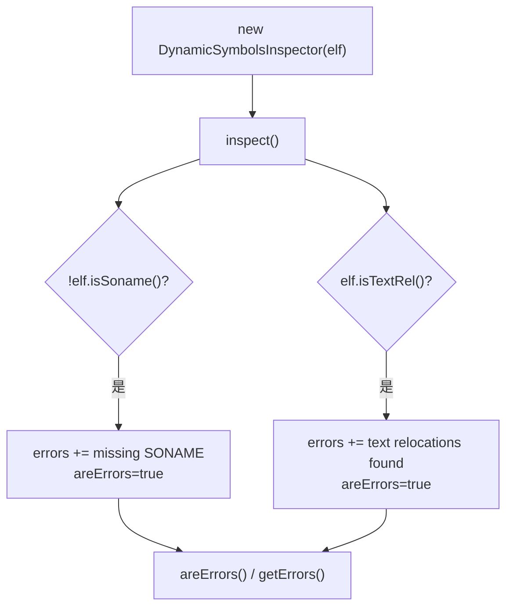

# 🧩 DynamicSymbolsInspector

<Badge type="tip" text="APK Dashboard" /> <Badge type="info" text="检查器" />

> 检查 .so 的 ELF 对象是否缺 SONAME 或存在 text relocations，把错误累积到单个字符串。

📁 源码：<code>ClassySharkWS/src/com/google/classyshark/silverghost/translator/apk/dashboard/DynamicSymbolsInspector.java</code> &nbsp; 📦 包：<code>com.google.classyshark.silverghost.translator.apk.dashboard</code>

## 职责

`DynamicSymbolsInspector` 是一个狭窄的原生库检查器：对单个 `Elf` 对象做两项检查——是否缺少 SONAME、是否存在 text relocations——命中任一就把错误信息累积进 `errors` 字符串并置 `areErrors=true`。构造函数即触发 `inspect()`，实例化即完成检查。由 `MultidexReader.fillApkDashboard` 为每个 `lib/` 条目实例化。

## 关键方法 / 字段

| 名称 | 类型 | 说明 |
|------|------|------|
| `elf` | Elf | 待检查的 ELF 对象 |
| `errors` | String | 累积的错误描述，初值 `""` |
| `areErrors` | boolean | 是否有错误标志 |
| `DynamicSymbolsInspector(Elf)` | 构造器 | 保存 elf 并立即 `inspect()` |
| `areErrors()` | boolean | 返回是否有错误 |
| `getErrors()` | String | 返回累积错误字符串 |
| `inspect()` | private void | 检查 isSoname/isTextRel 并写状态 |

## 工作流程

## 设计要点

- 🔍 **构造即检查** — 构造函数调 `inspect()`，实例化完成即结果就绪，调用方只需随后读 `areErrors()` / `getErrors()`。
- 🧩 **两项布尔检查** — 仅两个 `if`，分别对应 SONAME 缺失与 text relocation，是「每个原生库检查」的最小单元。
- 📝 **字符串累积** — 错误用 `+=` 拼进单个 `errors`，简单直接，无列表结构。
- ⚠️ **IOException 静默失败** — `inspect` 捕获 `IOException` 仅 `printStackTrace`，不传播、不置错误标志，检查中断时仪表板看不到该库的问题。

## 协作关系

- 被 [[MultidexReader]] 为每个 `lib/` 条目实例化
- 与 [[PrivateNativeLibsInspector]] 同属原生库检查维度

## 已知问题 / TODO

- `IOException` 被捕获后 `printStackTrace` 即吞掉，既不置 `areErrors` 也不写入 `errors`，原生库读取异常时仪表板会误判为「无问题」。

## 相关文档

- [APK Dashboard 架构](/reference/architecture/apk-dashboard)
- [Native 库检查](/reference/architecture/apk-dashboard)
