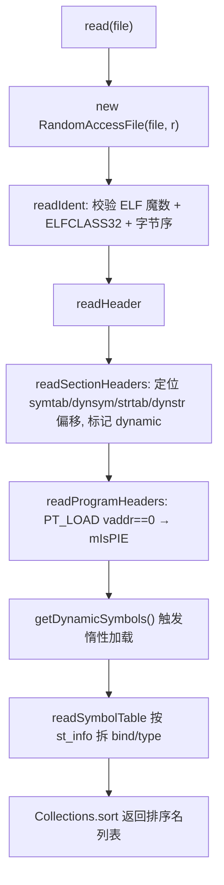

# 🧩 ElfReader

<Badge type="tip" text="Translator 核心" /> <Badge type="info" text="ELF 解析器" />

> 自包含的「穷人版 readelf」，解析 32 位 ELF 的节头、程序头与符号表。

📁 源码：<code>ClassySharkWS/src/com/google/classyshark/silverghost/translator/elf/ElfReader.java</code> &nbsp; 📦 包：<code>com.google.classyshark.silverghost.translator.elf</code>

## 职责

`ElfReader` 是一个独立的 ELF（Executable and Linkable Format）解析器，注释自称「a poor man's implementation of the readelf command」。它通过 `RandomAccessFile` 按小端/大端读取 ELF 头、节头表与程序头表，定位 `.symtab`/`.dynsym`/`.strtab`/`.dynstr`/`.dynamic` 等关键节，并提供惰性加载的 `getSymbol`/`getDynamicSymbol`/`getDynamicSymbols`。构造时强制 `ELFCLASS32`（`mClass==1`），遇到 64 位直接抛 `IOException`。代码源自 AOSP。

## 关键方法 / 字段

| 名称 | 类型 | 说明 |
|------|------|------|
| `ELF_IDENT` | static final byte[] | `{0x7F,'E','L','F'}`，魔数 |
| `ELFCLASS32` / `ELFCLASS64` | static final int | `1` / `2`，类别校验 |
| `ELFDATA2LSB` / `ELFDATA2MSB` | static final int | `1` / `2`，字节序标识 |
| `PT_LOAD` | static final long | `1`，可加载段类型，用于 PIE 判定 |
| `SHT_SYMTAB`/`SHT_DYNSYM`/`SHT_STRTAB`/`SHT_DYNAMIC` | static final int | 节类型常量 `2`/`11`/`3`/`6` |
| `Symbol` | static class | 符号：`name/bind/type`，构造器拆 `st_info` 为 bind(高半字节)/type(低半字节) |
| `read(File)` | static ElfReader | 工厂入口，构造并完成头解析 |
| `readIdent()` | private | 校验魔数、读 `mClass`/`mEndian`，非 ELFCLASS32 抛异常 |
| `readHeader()` | private | 读 ELF 头，分发节头与程序头解析 |
| `readSectionHeaders(...)` | private | 定位 symtab/dynsym/strtab/dynstr 偏移，标记 dynamic |
| `readProgramHeaders(...)` | private | 遍历程序头，`PT_LOAD` 虚地址 0 → PIE |
| `readSymbolTable(...)` | private | 按条目大小步进，读名字偏移与 `st_info` 构造 Symbol |
| `getSymbol(String)` / `getDynamicSymbol(String)` | Symbol | 惰性加载符号表，按名查询 |
| `getDynamicSymbols()` | List&lt;String&gt; | 触发动态符号加载后返回排序名列表 |
| `finalize()` | protected | 遗留：关闭 `RandomAccessFile` |

## 工作流程

## 设计要点

- 🧩 **仅支持 32 位** — `readIdent` 在 `mClass != ELFCLASS32` 时抛 `IOException("not ELFCLASS32!")`，明确不支持 64 位 ELF。
- 🔄 **双字节序** — `readHalf`/`readWord` 按 `mEndian`（`ELFDATA2LSB`/`ELFDATA2MSB`）选择小端或大端组装，兼容不同端序的 so。
- ⚡ **惰性符号加载** — `getSymbol`/`getDynamicSymbol` 首次调用时才 `readSymbolTable` 填充 `mSymbols`/`mDynamicSymbols`，避免无用解析开销。
- 🧩 **Symbol 拆解 st_info** — `Symbol` 构造器把单字节 `st_info` 拆为 `bind = (st_info >> 4) & 0x0F` 与 `type = st_info & 0x0F`，符合 ELF 符号表布局。
- 📐 **PIE 判定** — 程序头遍历中若 `PT_LOAD` 的虚拟地址为 0，标记 `mIsPIE`（位置无关可执行）。
- 📝 **源自 AOSP** — 文件头注释 `Copyright (C) 2011 The Android Open Source Project`，沿用 AOSP 的常量命名与布局抽象。

## 协作关系

- 被调用：[[ElfTranslator]]（`apply()` 调用 `read` + `getDynamicSymbols` 读动态符号）
- 同包协作：`nl.lxtreme.binutils.elf.Elf`（`ElfTranslator` 另用它读共享库依赖，因 binutils 缺动态符号表）

## 已知问题 / TODO

- ⚠️ **不支持 64 位 ELF** — 现代 Android（尤其 64 位 ABI）的 so 为 ELFCLASS64，本解析器直接抛异常无法处理。
- ⚠️ **遗留 `finalize` 关闭文件** — `finalize` 已被 JDK 逐步废弃，依赖它关闭 `RandomAccessFile` 不可靠，可能延迟释放文件句柄。
- ⚠️ `readString` 假设字符串长度 < 512（`mBuffer` 大小），超长符号会被截断返回 null。

## 相关文档

- [Translator 核心架构](/reference/architecture/translator-core)
- [模块索引](/reference/modules/Main)
