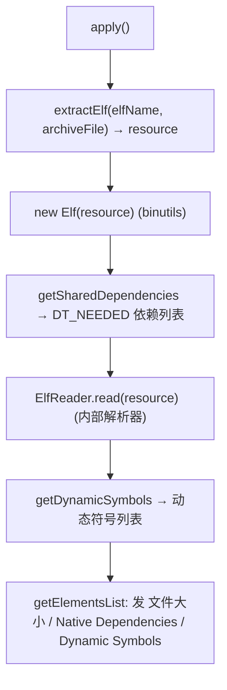

# 🧩 ElfTranslator

<Badge type="tip" text="Translator 核心" /> <Badge type="info" text="Translator 实现" />

> `.so` 树条目的翻译器：输出文件大小、本机依赖（`DT_NEEDED`）与动态符号列表。

📁 源码：<code>ClassySharkWS/src/com/google/classyshark/silverghost/translator/elf/ElfTranslator.java</code> &nbsp; 📦 包：<code>com.google.classyshark.silverghost.translator.elf</code>

## 职责

`ElfTranslator` 实现 `Translator`，处理 APK/归档中 `.so` 原生库条目。`apply` 先用静态 `extractElf` 从归档（`ZipInputStream`）扫出目标 `.so` 条目（经 `SherlockHash` 缓存到临时文件），再用两套 ELF 库读取：`nl.lxtreme.binutils.elf.Elf` 读共享库依赖（`DT_NEEDED`），再用内部 `ElfReader` 读动态符号表（因 binutils 不提供动态符号）。`getElementsList` 发出文件大小、Native Dependencies、Dynamic Symbols 三段 `ELEMENT`。

## 关键方法 / 字段

| 名称 | 类型 | 说明 |
|------|------|------|
| `archiveFile` | File | 宿主归档（apk 等） |
| `resource` | File | 提取出的 .so 临时文件 |
| `elfName` | String | 目标条目名（如 `lib/.../libfoo.so`） |
| `dependencies` | String | 本机依赖（DT_NEEDED）拼接文本 |
| `dynamicSymbols` | StringBuilder | 动态符号拼接文本 |
| `getClassName()` | String | 返回 `archiveFile.getName()` |
| `addMapper(TokensMapper)` | void | 空操作 |
| `apply()` | void | 提取 .so → 读依赖 + 读动态符号 |
| `getElementsList()` | List&lt;ELEMENT&gt; | 发文件大小 / 依赖 / 动态符号三段 |
| `getDependencies()` | List&lt;String&gt; | 返回空 `LinkedList` |
| `extractElf(String, File)` | static File | 扫 zip 找条目，经 SherlockHash 缓存提取 .so |

## 工作流程

## 设计要点

- 🧰 **双 ELF 库协作** — binutils 的 `Elf` 能读 `DT_NEEDED` 共享库依赖但缺动态符号表，故另用内部 `ElfReader` 补动态符号，二者职责互补。
- 📦 **条目提取 + 缓存** — `extractElf` 用 `ZipInputStream` 线性扫描，命中后委托 `SherlockHash.INSTANCE.getFileFromZipStream` 把条目落盘（带缓存），避免重复解压。
- 📊 **复用 readableFileSize** — 文件大小经 `static import` 自 `JarInfoTranslator.readableFileSize`，跨翻译器统一格式化。
- 🏗️ **三段式输出** — `getElementsList` 用 `TAG.DOCUMENT` 与 `TAG.IDENTIFIER` 交替发出标题/正文，UI 可按标签着色区分段落。
- ⚠️ **空异常吞没** — `apply` 的 `try` 块 `catch (Exception e) {}` 完全静默，连日志都不打。

## 协作关系

- 依赖：[[Translator]]（实现接口）
- 依赖：[[ElfReader]]（读动态符号）
- 依赖：[[SherlockHash]]（`extractElf` 缓存提取）
- 依赖：[[JarInfoTranslator]]（`readableFileSize`）
- 依赖：`nl.lxtreme.binutils.elf.Elf`（读共享库依赖）
- 被创建：[[TranslatorFactory]]（`.so` 分支）
- 被调用：[[DisplayArea]]（消费 `getElementsList()`）

## 已知问题 / TODO

- ⚠️ **`apply` 静默吞异常** — `catch (Exception e) {}` 空块，ELF 解析失败时无任何提示，UI 仅看到空内容。
- ⚠️ 源码注释两条 TODO：`currently support only dexes, here is how to do for jar` 与引用 `native-utils`（https://github.com/adamheinrich/native-utils/blob/master/NativeUtils.java），暗示原生库加载路径有改进计划。
- ⚠️ `extractElf` 失败时返回硬编码的 `new File("classes.dex")` 作为兜底，后续 `Elf(resource)` 必然解析失败，行为隐蔽。
- ⚠️ `getClassName` 返回 `archiveFile.getName()` 而非 `elfName`，与树节点显示可能不一致。

## 相关文档

- [Translator 核心架构](/reference/architecture/translator-core)
- [模块索引](/reference/modules/Main)
