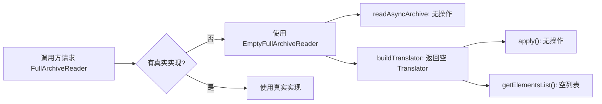

# 🧩 EmptyFullArchiveReader

<Badge type="tip" text="插件" /> <Badge type="info" text="空对象模式" />

> `FullArchiveReader` 接口的空实现（Null Object），所有方法无操作，提供安全默认值避免 NPE。

📁 源码：<code>ClassySharkWS/src/com/google/classyshark/silverghost/plugins/EmptyFullArchiveReader.java</code> &nbsp; 📦 包：<code>com.google.classyshark.silverghost.plugins</code>

## 职责

`EmptyFullArchiveReader` 是 `FullArchiveReader` 接口的 Null Object 实现。它的 `readAsyncArchive` 是空操作，`buildTranslator` 返回一个所有方法都空操作的匿名 `Translator`（类名恒为 `"Empty"`，元素/依赖列表返回空 `LinkedList`）。在未配置真实归档读取器或作为测试桩时，用它替代 `null` 引用，保证调用链不会因空指针崩溃。

## 关键方法 / 字段

| 名称 | 类型 | 说明 |
|------|------|------|
| `readAsyncArchive(File)` | void | 接口实现：空操作 |
| `buildTranslator(String, File)` | Translator | 返回匿名空行为 `Translator` |
| （匿名）`getClassName()` | String | 恒返回 `"Empty"` |
| （匿名）`addMapper(TokensMapper)` | void | 空操作 |
| （匿名）`apply()` | void | 空操作 |
| （匿名）`getElementsList()` | List&lt;ELEMENT&gt; | 返回空 `LinkedList` |
| （匿名）`getDependencies()` | List&lt;String&gt; | 返回空 `LinkedList` |

## 工作流程

## 设计要点

- 🚫 **Null Object 模式** — 用"空行为对象"替代 `null`，调用方无需判空，消除 NPE 风险。
- 🧱 **双重空对象** — 不仅自身方法为空操作，`buildTranslator` 还返回一个内部匿名 `Translator`，把空行为传播到翻译器层。
- 📋 **空集合而非 null** — `getElementsList`/`getDependencies` 返回 `new LinkedList<>()` 而非 null，下游遍历安全。
- 🧪 **测试友好** — 作为测试桩可注入任何依赖 `FullArchiveReader` 的组件，无需构造真实归档。
- 🔤 **标识类名** — 匿名 Translator 的 `getClassName()` 返回 `"Empty"`，便于在输出中识别占位来源。

## 协作关系

- 实现 → [[FullArchiveReader]]（接口）
- 返回 → [[Translator]]（匿名空实现）
- 引用 → [[TokensMapper]]（`addMapper` 参数类型，空实现忽略）

## 已知问题 / TODO

- 无明显已知问题。作为 Null Object，其"空"行为即设计意图。

## 相关文档

- [插件子系统](/reference/architecture/plugins)
- [翻译器层](/reference/architecture/translator)
