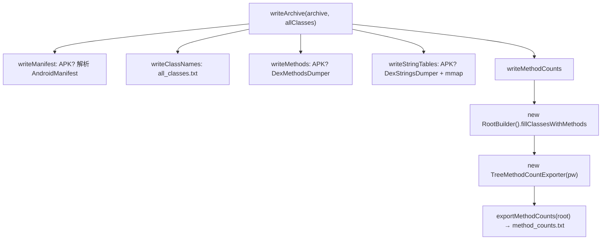

# 🧩 Exporter

<Badge type="tip" text="导出器" /> <Badge type="info" text="静态工具类" />

> 把归档数据批量导出为多个文本文件的静态工具类，串联 manifest、类名表、方法表、字符串表、方法计数树全流程。

📁 源码：<code>ClassySharkWS/src/com/google/classyshark/silverghost/exporter/Exporter.java</code> &nbsp; 📦 包：<code>com.google.classyshark.silverghost.exporter</code>

## 职责

`Exporter` 是导出子系统的统一入口。`writeArchive` 一次性把一个归档的元数据与内容拆写成五个文本文件：`<manifest>_dump`、`all_classes.txt`、`all_methods.txt`、`all_strings.txt`、`method_counts.txt`。其中方法计数文件由它调 `RootBuilder` 构建树后用 `TreeMethodCountExporter` 渲染；方法表与字符串表仅对 APK 生效，分别委托 `DexMethodsDumper`/`DexStringsDumper`。大字符串表用 `FileChannel.map`（mmap）写入。

## 关键方法 / 字段

| 名称 | 类型 | 说明 |
|------|------|------|
| `Exporter()` | private 构造器 | 禁止实例化，纯静态工具 |
| `writeArchive(File, List<String>)` | static void | 全流程入口：manifest→类名→方法→字符串→计数 |
| `writeMethodCounts(File)` | static void | 建 `RootBuilder` 树 + `TreeMethodCountExporter` 输出 `method_counts.txt` |
| `writeManifest(File)` | static void | APK 专属：`TranslatorFactory` 解析 `AndroidManifest.xml` |
| `writeClassNames(List<String>)` | static void | 写 `all_classes.txt` |
| `writeMethods(File)` | static void | APK 专属：`DexMethodsDumper.dumpMethods` → `all_methods.txt` |
| `writeStringTables(File)` | static void | APK 专属：`DexStringsDumper.dumpStrings` → `all_strings.txt`（mmap） |
| `writeListStringsChannel(File, List<String>)` | private static void | mmap 写大字符串表 |
| `writeCurrentClass(String, String)` | static void | 单类转储：`<className>_dump` |
| `main(String[])` | static void | 独立运行入口：加载 android.jar 并写类名表 |

## 工作流程

## 设计要点

- 🚪 **私有构造 + 全静态方法** — 典型工具类范式，无状态，无需实例化。
- 🔗 **全流程串联** — `writeArchive` 编排五个子步骤，调用方一次调用即得全部产物。
- 🧱 **策略注入** — 方法计数渲染通过 `MethodCountExporter` 接口交给 `TreeMethodCountExporter`，树形/扁平可互换。
- ⚡ **mmap 大文件写入** — `writeListStringsChannel` 用 `FileChannel.map(READ_WRITE)` 预分配定长行缓冲，对超大字符串表比普通 `FileWriter` 更高效。
- 🛡️ **APK 守卫** — `writeMethods`/`writeStringTables`/`writeManifest` 都以 `endsWith(".apk")` 前置 return 守卫，非 APK 静默跳过。
- 🤐 **异常吞没** — `writeListStrings`/`writeListStringsChannel` 的 `catch(IOException){}` 空块静默忽略写失败。

## 协作关系

- 调用 → [[RootBuilder]]（构建方法计数树）
- 调用 → [[TreeMethodCountExporter]]（渲染计数树）
- 调用 → [[MethodCountExporter]]（策略接口）
- 调用 → [[TranslatorFactory]]（解析 manifest）
- 调用 → [[DexMethodsDumper]] / [[DexStringsDumper]]（APK 方法/字符串表）
- 调用 → [[ContentReader]]（`main` 中加载归档类名）

## 已知问题 / TODO

- 🤐 多个写方法用空 `catch(IOException){}` 吞掉异常，写盘失败时无任何告警。
- 📏 `writeListStringsChannel` 按"定长行 × 数量"预分配 mmap 大小，若实际字符串超长会被截断/越界（`buffer` 是固定空白行模板）。
- 🧪 `main` 硬编码 `~/Desktop/Scenarios/2 Samples/android.jar` 路径，仅适合作者本机调试。

## 相关文档

- [导出器子系统](/reference/architecture/exporter)
- [方法计数子系统](/reference/architecture/methodscounter)
- [翻译器层](/reference/architecture/translator)
