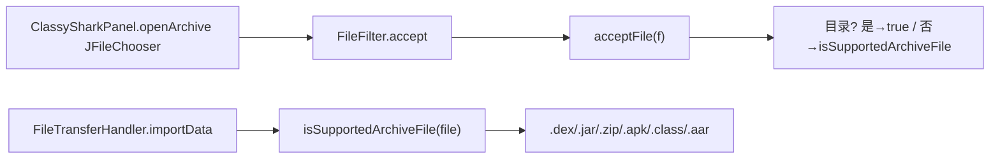

# 🧩 FileChooserUtils

<Badge type="tip" text="GUI IO 层" /> <Badge type="info" text="静态工具" />

> 支持扩展名名单一事实源，供 JFileChooser 过滤器与拖放接受器共用。

📁 源码：<code>ClassySharkWS/src/com/google/classyshark/gui/panel/io/FileChooserUtils.java</code> &nbsp; 📦 包：<code>com.google.classyshark.gui.panel.io</code>

## 职责

`FileChooserUtils` 是静态工具类，定义 ClassyShark 支持的存档扩展名名单一事实源：`.dex`/`.jar`/`.zip`/`.apk`/`.class`/`.aar`。`acceptFile` 供 `JFileChooser` 过滤器用，`isSupportedArchiveFile` 供拖放接受器用，`getFileChooserDescription` 返回描述串。

## 关键方法 / 字段

| 名称 | 类型 | 说明 |
|------|------|------|
| `acceptFile(File)` | static boolean | 目录或支持存档 |
| `getFileChooserDescription()` | static String | 返回 `dex, jar, apk, class, aar` |
| `isSupportedArchiveFile(File)` | static boolean | 匹配 .dex/.jar/.zip/.apk/.class/.aar |
| `FileChooserUtils()` | private | 私有构造 |

## 工作流程

## 设计要点

- 🎯 **单一事实源** — `isSupportedArchiveFile` 是支持扩展名的唯一来源，文件选择器与拖放共用。
- 📁 **目录放行** — `acceptFile` 对目录返回 true，让选择器可浏览目录。
- 🧰 **纯静态** — 私有构造，不可实例化。

## 协作关系

- 被调用 ← [[ClassySharkPanel]]、[[FileTransferHandler]]

## 已知问题 / TODO

- 🐛 **已知不一致** — `.zip` 在 `isSupportedArchiveFile` 中受支持，但 `TranslatorFactory` 无 `.zip` 路由，拖入 zip 会接受但无法翻译。
- 🐛 `getFileChooserDescription` 返回串不含 `.zip`，与 `isSupportedArchiveFile` 实际支持的列表不完全一致。

## 相关文档

- [GUI 架构](/reference/architecture/gui-layer)
- [[FileTransferHandler]]
