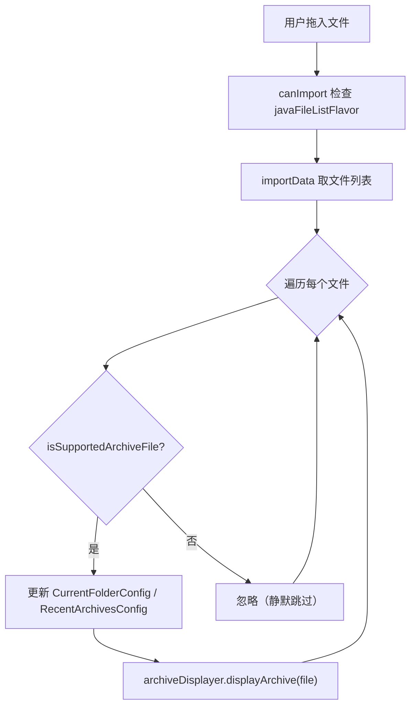

# 🧩 FileTransferHandler

<Badge type="tip" text="GUI IO 层" /> <Badge type="info" text="策略模式" />

> 拖放 Swing TransferHandler 子类，把拖入的存档文件交给 ArchiveDisplayer 显示。

📁 源码：<code>ClassySharkWS/src/com/google/classyshark/gui/panel/FileTransferHandler.java</code> &nbsp; 📦 包：<code>com.google.classyshark.gui.panel</code>

## 职责

`FileTransferHandler` 继承 Swing `TransferHandler`，注册在类树、显示区、环形图三个放置区上。它接收拖入的文件列表，经 `FileChooserUtils.isSupportedArchiveFile` 过滤，更新当前目录与最近存档配置，再调用 `ArchiveDisplayer.displayArchive` 加载。它只依赖最小接口 `ArchiveDisplayer`，而非整个 `ClassySharkPanel`。

## 关键方法 / 字段

| 名称 | 类型 | 说明 |
|------|------|------|
| `archiveDisplayer` | ArchiveDisplayer | 注入的最小显示接口 |
| `getSourceActions(JComponent)` | int | 返回 `COPY_OR_MOVE` |
| `canImport(TransferSupport)` | boolean | 仅接受 `javaFileListFlavor` |
| `importData(TransferSupport)` | boolean | 遍历拖放文件，过滤后加载 |

## 工作流程

## 设计要点

- 🪜 **最小接口依赖** — 构造接收 `ArchiveDisplayer` 而非 `ClassySharkPanel`，可在任意实现该接口的组件上复用。
- 🤫 **静默跳过不支持文件** — 不支持的文件被忽略但不中止整个传输，多文件拖入时合法文件仍会加载。
- 📁 **副作用同步配置** — 拖放加载也会更新「当前目录」与「最近存档」，与按钮打开路径行为一致。
- 🔁 **三处复用** — 树/显示区/环形图均注册同一类实例，行为统一。

## 协作关系

- 依赖 → [[ArchiveDisplayer]]（最小接口）
- 依赖 → [[FileChooserUtils]]、[[CurrentFolderConfig]]、[[RecentArchivesConfig]]
- 被注册 ← [[FilesTree]]、[[DisplayArea]]、[[RingChartPanel]]

## 已知问题 / TODO

- 🐛 `importData` 对 `UnsupportedFlavorException` / `IOException` 一律返回 `false` 且不记录日志，调试困难。
- 🐛 未对 `data` 列表元素做类型检查即强转 `(File) item`，非 File 元素会抛 `ClassCastException`。

## 相关文档

- [GUI 架构](/reference/architecture/gui-layer)
- [[ArchiveDisplayer]]
