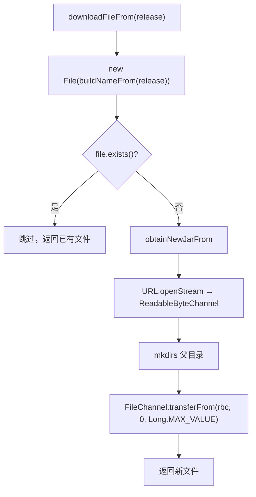

# 🧩 FileUtils

<Badge type="tip" text="更新子系统" /> <Badge type="info" text="IO 工具" />

> 文件下载与管理：幂等下载（已存在跳过）用 NIO Channels 零拷贝式传输，另有覆盖旧 jar 的方法。

📁 源码：<code>ClassySharkWS/src/com/google/classyshark/updater/utils/FileUtils.java</code> &nbsp; 📦 包：<code>com.google.classyshark.updater.utils</code>

## 职责

`FileUtils` 负责更新子系统的文件下载与管理。`downloadFileFrom(Release)` 是幂等下载：按 `NamingUtils.buildNameFrom(release)` 确定目标文件，若已存在则直接返回（跳过下载），否则 `obtainNewJarFrom` 用 NIO `Channels.newChannel` + `FileChannel.transferFrom` 零拷贝式下载。`overwriteOld(File)`（私有，疑似未被调用）用 `Files.copy(REPLACE_EXISTING)` 覆盖旧 jar 后删除临时文件。幂等下载避免重复下载同一新版本。

## 关键方法 / 字段

| 名称 | 类型 | 说明 |
|------|------|------|
| `downloadFileFrom(Release)` | static File | 幂等下载：已存在跳过 |
| `obtainNewJarFrom(Release, File)` | private static void | NIO Channels.transferFrom 下载 |
| `overwriteOld(File)` | private void | Files.copy REPLACE_EXISTING 覆盖旧 jar |

## 工作流程

## 设计要点

- 🆔 **幂等下载** — 文件已存在即跳过，避免重复下载同一 release。
- ⚡ **NIO 零拷贝式传输** — `FileChannel.transferFrom` 直接在通道间搬数据，避免用户态缓冲拷贝。
- 🏠 **父目录自动创建** — `file.getParentFile().mkdirs()` 确保目标路径存在。
- 🗑️ **overwriteOld 覆盖后删除** — 用 `REPLACE_EXISTING` 覆盖旧 jar 再删临时文件（疑似未调用）。

## 协作关系

- 依赖：[[NamingUtils]]（buildNameFrom、extractCurrentPath）、[[Release]]（getDownloadURL）
- 被调用：[[AbstractDownloader]]（`obtainNew` 下载）

## 已知问题 / TODO

- `overwriteOld` 为私有且未在类内被调用（死代码），且其 `extractCurrentPath() + FILENAME` 中 `FILENAME` 来自 `javax.script.ScriptEngine` 的常量（疑似误导入）。
- `obtainNewJarFrom` 流与 channel 未在异常路径下关闭（资源泄漏风险）。
- `overwriteOld` 是实例方法但 `downloadFileFrom` 是静态方法，混用 static/实例风格。

## 相关文档

- [更新子系统架构](/reference/architecture/updater)
