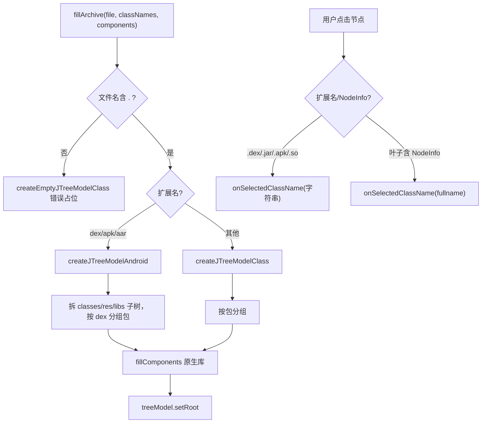

# 🧩 FilesTree

<Badge type="tip" text="GUI 导航层" /> <Badge type="info" text="构建器" />

> 左侧 JTree 导航，按扩展名选择 Android 多 dex 布局或普通包分组布局。

📁 源码：<code>ClassySharkWS/src/com/google/classyshark/gui/panel/tree/FilesTree.java</code> &nbsp; 📦 包：<code>com.google.classyshark.gui.panel.tree</code>

## 职责

`FilesTree` 负责构建并管理左侧导航树。它根据存档扩展名（`.dex`/`.apk`/`.aar` 走 Android 多 dex 布局，其余走普通按包分组布局）选择不同的树模型构建策略，把类名列表与原生库组件组织成层级树。选择监听按节点扩展名与是否带 `NodeInfo` 叶子路由点击事件回 `ViewerController`。它自带 `FileTransferHandler` 支持拖放。

## 关键方法 / 字段

| 名称 | 类型 | 说明 |
|------|------|------|
| `viewerController` | ViewerController | 注入的窄回调接口 |
| `fillArchive(File, List, List)` | void | 据扩展名分发树构建 |
| `createJTreeModelAndroid(...)` | TreeNode | 多 dex：拆 classes/res/libs 子树，按包按 dex 分组 |
| `createJTreeModelClass(...)` | TreeNode | jar/class：仅按包分组 |
| `fillComponents(...)` | void | 原生库节点归入 libs 子树并排序 |
| `configureJTree(JTree)` | private void | 设选择监听、字体、单选模式 |
| `setVisibleRoot()` | void | 让根节点可见 |
| `getJTree()` | Component | 返回树组件供宿主布局 |

## 工作流程

## 设计要点

- 🌳 **双布局策略** — Android 存档（dex/apk/aar）用多 dex 层级（classes/res/libs 子树、按 dex 分组包），jar/class 用扁平包分组，按扩展名自动选择。
- 🏷️ **NodeInfo 短名** — 叶子节点用 `NodeInfo` 包装，树显示简单类名但持全限定名，选择时读回 fullname。
- 🎨 **共享渲染器** — 使用 `CellRenderer`，与方法计数树共享同一主题感知渲染器。
- 🖱️ **扩展名路由** — 选择监听按 `.dex/.jar/.apk/.so` 等扩展名直接当作存档节点处理，否则当作类叶子。
- 🧪 **独立 main 测试** — `main` 方法用 `ContentReader` + `Reducer` 独立可视化某 jar 的树。

## 协作关系

- 依赖 → [[ViewerController]]（窄回调）
- 依赖 → [[NodeInfo]]、[[CellRenderer]]、[[FileTransferHandler]]
- 依赖 → `ContentReader`、[[Reducer]]（main 测试）
- 依赖 → [[GuiMode]]（主题）

## 已知问题 / TODO

- 🐛 `fillArchive` 对无扩展名文件（`!loadedFile.getName().contains(".")`）走 `createEmptyJTreeModelClass`，但 `.so` 等非类存档也会落到普通分支，行为边界模糊。
- 🐛 选择监听里多处 `endsWith(".dex"/".jar"/".apk"/".so")` 用独立 if 重复，可合并。
- 🐛 `createJTreeModelAndroid` 中 `packageNode != null && currentClassesDex.isLeaf()` 的「hack for manually stripped APKs」注释表明对剥离 APK 的特殊处理较脆弱。

## 相关文档

- [GUI 架构](/reference/architecture/gui-layer)
- [[NodeInfo]]
- [[CellRenderer]]
