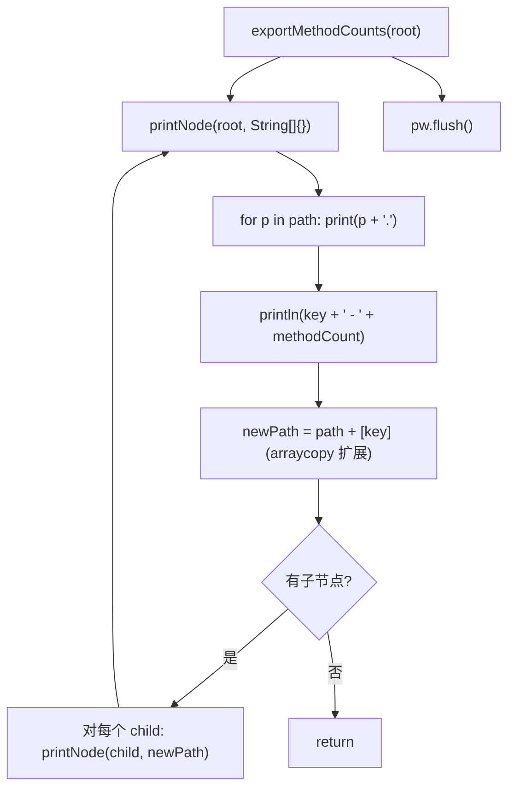

# 🧩 FlatMethodCountExporter

<Badge type="tip" text="导出器" /> <Badge type="info" text="策略实现" />

> 方法计数树的扁平化导出器，递归把每个节点打印成"全限定路径 - 计数"一行。

📁 源码：<code>ClassySharkWS/src/com/google/classyshark/silverghost/exporter/FlatMethodCountExporter.java</code> &nbsp; 📦 包：<code>com.google.classyshark.silverghost.exporter</code>

## 职责

`FlatMethodCountExporter` 实现 `MethodCountExporter` 接口，以扁平列表形式输出方法计数树。它深度优先递归遍历 `ClassNode`，用 `String[]` 累积从根到当前节点的路径前缀，把每个节点渲染为一行 `a.b.c - N`（全限定路径 + 方法数）。输出无缩进层级，适合 grep/排序等后续文本处理。

## 关键方法 / 字段

| 名称 | 类型 | 说明 |
|------|------|------|
| `pw` | private PrintWriter | 输出目标 |
| `FlatMethodCountExporter(PrintWriter)` | 构造器 | 注入输出流 |
| `exportMethodCounts(ClassNode)` | void | 接口实现：从根递归 `printNode`，最后 `flush` |
| `printNode(ClassNode, String[])` | private void | 递归核心：拼路径前缀 + 打印当前节点 + 扩展路径下钻 |

## 工作流程

## 设计要点

- 📜 **扁平全限定输出** — 不渲染缩进/拐角，每行是完整包路径 + 计数，一行一类/一包。
- 🧮 **String[] 前缀累积** — 用 `System.arraycopy` 把父路径复制到长度+1 的新数组再追加当前 key，实现不可变式路径传递（每层新建数组，避免回溯重置）。
- 🔄 **深度优先递归** — 遍历顺序为前序（先打印自身再下钻子节点），符合"父包在前、子包在后"的自然阅读顺序。
- 💧 **统一 flush** — 递归结束后统一 `pw.flush()`，确保所有缓冲内容落盘。

## 协作关系

- 实现 → [[MethodCountExporter]]（策略接口）
- 遍历 → [[ClassNode]]（通过 `getChildNodes()` 递归）
- 可被 → [[Exporter]] 调用（作为 `TreeMethodCountExporter` 的可替换替代）

## 已知问题 / TODO

- 无明显已知问题。扁平格式简单稳定。

## 相关文档

- [导出器子系统](/reference/architecture/exporter)
- [方法计数子系统](/reference/architecture/methodscounter)
