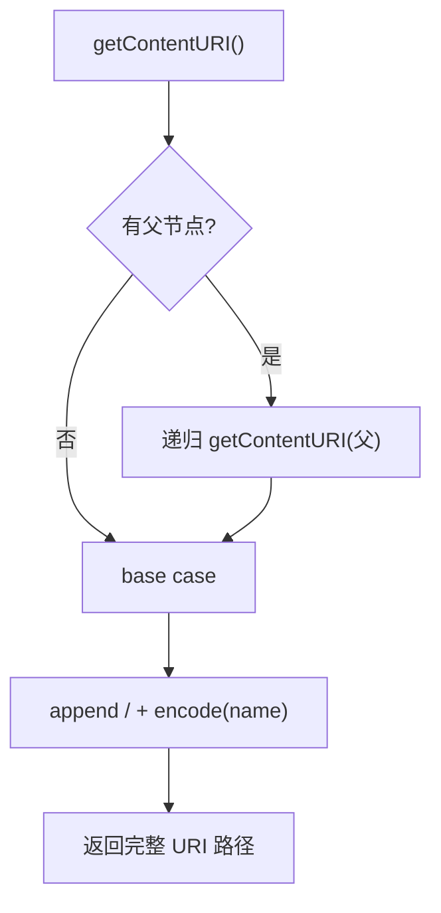

# 🧩 FocusPoint

<Badge type="tip" text="分析子系统" /> <Badge type="info" text="数据模型" />

> 跟踪事件数据模型：支持父子层级，递归生成经 UTF-8 URL 编码的内容 URI 与标题。

📁 源码：<code>ClassySharkWS/src/com/google/classyshark/analytics/FocusPoint.java</code> &nbsp; 📦 包：<code>com.google.classyshark.analytics</code>

## 职责

`FocusPoint` 表示一个跟踪事件数据点（如应用加载、模块加载、用户动作、错误事件等），支持父子层级结构（`parentFocusPoint`）。`getContentURI()` 递归拼接父节点名，用 `/` 分隔并逐段做 UTF-8 URL 编码，对应 GA 的 `utmp` 参数；`getContentTitle()` 用 `-` 分隔递归拼接，对应 `utmdt` 参数。树形事件结构通过递归生成完整的 GA 路径与标题串。

## 关键方法 / 字段

| 名称 | 类型 | 说明 |
|------|------|------|
| `name` | private String | 本节点事件名 |
| `parentFocusPoint` | private FocusPoint | 父节点（可空） |
| `URI_SEPARATOR` | static final String | `/`，URI 分隔 |
| `TITLE_SEPARATOR` | static final String | `-`，标题分隔 |
| `FocusPoint(String)` | 构造器 | 仅名称 |
| `FocusPoint(String, FocusPoint)` | 构造器 | 名称 + 父节点 |
| `getContentURI()` | String | 递归拼接 `/parent/.../name`，UTF-8 编码 |
| `getContentTitle()` | String | 递归拼接 `parent-...-name`，UTF-8 编码 |
| `setParentTrackPoint(FocusPoint)` | void | 设置父节点 |

## 工作流程

## 设计要点

- 🌳 **树形事件结构** — 父子链可任意深，递归生成路径，对应 GA utmp/utmdt。
- 🔤 **UTF-8 URL 编码** — 每段 `name` 经 `URLEncoder.encode`，支持非 ASCII 事件名；编码异常时回退原值。
- 🪶 **轻量数据模型** — 仅 name + parent，无业务逻辑，纯 POJO。
- 🔄 **递归 base case** — `parentFocuPoint == null` 时停止递归。

## 协作关系

- 依赖：无（纯数据）
- 被调用：[[JGoogleAnalyticsTracker]]（track 的入参）、[[GoogleAnalytics_v1_URLBuildingStrategy]]（getContentURI/getContentTitle）、[[Analytics]]（构造 Activation 事件）

## 已知问题 / TODO

- 使用 `StringBuffer` 而非 `StringBuilder`（无同步需求，性能略损但可忽略）。
- `setParentTrackPoint` 与构造器 `FocusPoint(name, parent)` 功能重叠，命名不一致（"TrackPoint" vs "FocusPoint"）。

## 相关文档

- [分析子系统架构](/reference/architecture/analytics)
