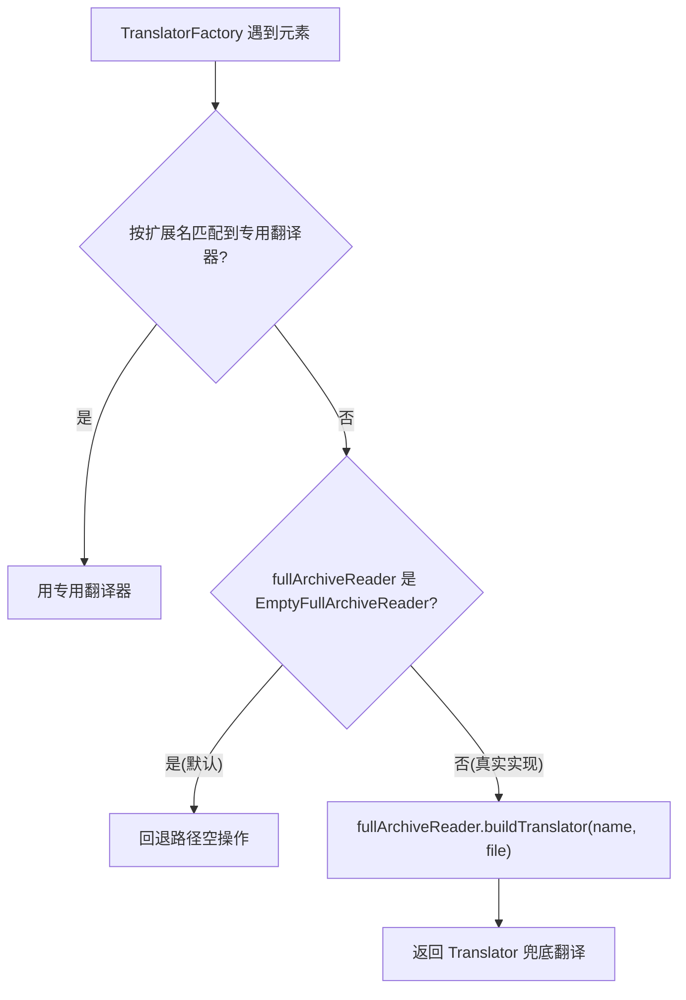

# 🧩 FullArchiveReader

<Badge type="tip" text="silverghost 核心" /> <Badge type="info" text="SPI 扩展点" />

> 全量归档读取的 SPI 接口，供 TranslatorFactory 在无匹配扩展名时回退调用。

📁 源码：<code>ClassySharkWS/src/com/google/classyshark/silverghost/FullArchiveReader.java</code> &nbsp; 📦 包：<code>com.google.classyshark.silverghost</code>

## 职责

`FullArchiveReader` 是 silverghost 子系统的一个 SPI（服务提供者接口）扩展点。它定义了两个方法：异步预读整个归档，以及按类名构建一个 `Translator`。当 [[TranslatorFactory]] 遇到无法按扩展名匹配到专用翻译器的元素时，会回退调用 `buildTranslator` 交给 FullArchiveReader 实现来兜底翻译。[[SilverGhost]] 在静态块默认注入 `EmptyFullArchiveReader`（空实现），使默认场景下该回退路径为空操作，第三方可替换为真实实现。

## 关键方法 / 字段

| 名称 | 类型 | 说明 |
|------|------|------|
| `readAsyncArchive(File file)` | void | 异步预读整个归档，为后续 buildTranslator 做准备 |
| `buildTranslator(String className, File archiveFile)` | Translator | 按类名从全量归档构建一个 Translator 实例 |

## 工作流程

## 设计要点

- 🧩 **纯 SPI 接口** — 仅声明两个方法，无字段无默认逻辑，把「如何全量读取归档」完全留给实现方。
- 🔍 **回退兜底语义** — 它的存在是为了给 TranslatorFactory 的扩展名匹配失败场景提供兜底，`buildTranslator` 即兜底翻译入口。
- 📦 **默认空实现解耦** — [[SilverGhost]] 静态块注入 `EmptyFullArchiveReader`，使核心流程不依赖任何具体全量读取实现，第三方按需替换。
- 🎨 **异步预读** — `readAsyncArchive` 名字暗示可后台预读，调用方（SilverGhost.readContents）在阶段 1 末尾就触发它，使后续 translateArchiveElement 时数据可能已就绪。

## 协作关系

- 依赖：[[Translator]]（buildTranslator 返回类型）
- 实现方：[[EmptyFullArchiveReader]]（默认空实现）
- 被调用：[[SilverGhost]]（持有静态 fullArchiveReader 插槽）
- 被调用：[[TranslatorFactory]]（回退调用 buildTranslator）

## 已知问题 / TODO

- 无明显已知问题。默认 EmptyFullArchiveReader 使回退路径安全无副作用，真实实现需由第三方提供。

## 相关文档

- [silverghost 核心架构](/reference/architecture/silverghost)
- [翻译器工厂](/reference/architecture/translator-factory)
- [API 指南](/api/index)
