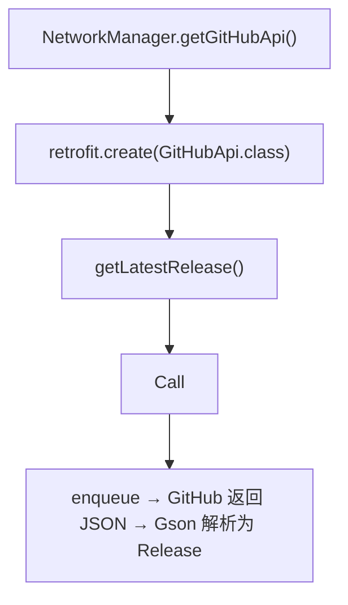

# 🧩 GitHubApi

<Badge type="tip" text="更新子系统" /> <Badge type="info" text="Retrofit 接口" />

> Retrofit 接口：声明式描述 `GET repos/google/android-classyshark/releases/latest`，endpoint 为 `https://api.github.com/`。

📁 源码：<code>ClassySharkWS/src/com/google/classyshark/updater/networking/GitHubApi.java</code> &nbsp; 📦 包：<code>com.google.classyshark.updater.networking</code>

## 职责

`GitHubApi` 是一个 Retrofit 接口，声明式描述访问 GitHub API 所需的端点与路径。它定义常量 `ENDPOINT = "https://api.github.com/"`（供 `NetworkManager` 作 Retrofit baseUrl），以及一个 `@GET("repos/google/android-classyshark/releases/latest")` 注解的方法 `getLatestRelease()`，返回 `Call<Release>`——Retrofit 会把响应 JSON 经 Gson 解析为 `Release` 对象。它本身不含任何实现，仅是 API 的声明式描述。

## 关键方法 / 字段

| 名称 | 类型 | 说明 |
|------|------|------|
| `ENDPOINT` | static final String | `https://api.github.com/` |
| `getLatestRelease()` | Call&lt;Release&gt; | `@GET repos/google/android-classyshark/releases/latest` |

## 工作流程

## 设计要点

- 📜 **声明式 API** — Retrofit 注解描述 HTTP 方法与路径，无手写 URL 拼装与解析代码。
- 🏠 **硬编码仓库路径** — `repos/google/android-classyshark/releases/latest` 写死在注解中。
- 🔗 **返回 `Call<Release>`** — 支持 Retrofit 的同步/异步调用模式（本项目用异步 enqueue）。

## 协作关系

- 依赖：[[Release]]（响应载荷类型）
- 被调用：[[NetworkManager]]（`retrofit.create`）、[[AbstractDownloader]]（`getLatestRelease`）

## 已知问题 / TODO

- 仓库路径硬编码为 `google/android-classyshark`，fork 后无法配置。
- 未带 `Accept`/`Authorization` 头，匿名请求受 GitHub API 速率限制（60 次/小时/IP）。

## 相关文档

- [更新子系统架构](/reference/architecture/updater)
