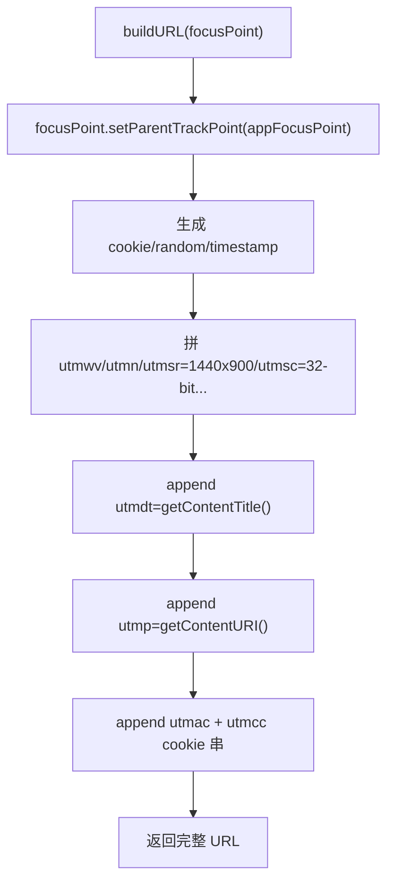

# 🧩 GoogleAnalytics_v1_URLBuildingStrategy

<Badge type="tip" text="分析子系统" /> <Badge type="info" text="策略实现" />

> 构建 Urchin/GA v1 `__utm.gif` 跟踪 URL：老式 urchin.js 协议的纯 Java 实现，硬编码屏幕分辨率等假数据。

📁 源码：<code>ClassySharkWS/src/com/google/classyshark/analytics/GoogleAnalytics_v1_URLBuildingStrategy.java</code> &nbsp; 📦 包：<code>com.google.classyshark.analytics</code>

## 职责

`GoogleAnalytics_v1_URLBuildingStrategy` 实现 `URLBuildingStrategy`，负责把一个 `FocusPoint` 拼装成完整的 Google Analytics v1（Urchin）`__utm.gif` 跟踪 URL。它以 `http://www.google-analytics.com/__utm.gif` 为前缀，附加 `utmwv=1` 版本号、随机 `utmn`、`utmsr=1440x900` 屏幕分辨率、`utmsc=32-bit` 色深、`utmhn=主机名`、`utmr=referer`、`utmp=内容URI`、`utmdt=标题`、`utmac=跟踪码` 以及一长串 `utmcc` cookie 参数。屏幕分辨率、色深、语言、Flash 版本等均为硬编码假数据，cookie/random/timestamp 用 `Random` 与 `Date` 生成。这是老式 urchin.js 协议的纯 Java 实现。

## 关键方法 / 字段

| 名称 | 类型 | 说明 |
|------|------|------|
| `appFocusPoint` | private FocusPoint | 应用名/版本作为根事件 |
| `googleAnalyticsTrackingCode` | private String | GA 跟踪码 |
| `refererURL` | private String | 默认 `http://www.BoxySystems.com` |
| `TRACKING_URL_Prefix` | static final String | `__utm.gif` 端点 |
| `random` | static final Random | 生成 cookie/random |
| `hostName` | static String | 本机主机名（静态块初始化） |
| `buildURL(FocusPoint)` | String | 拼装完整跟踪 URL |
| `setRefererURL(String)` | void | 设置 referer |

## 工作流程

## 设计要点

- 📜 **历史背景** — 基于 Google Analytics 早期 urchin.js 协议（`__utm.gif` 像素追踪），与现代 Measurement Protocol / GA4 完全不同。
- 🔧 **硬编码环境数据** — 屏幕分辨率 `1440x900`、色深 `32-bit`、语言 `en-us`、Flash `9.0 r28` 均为假数据，不读取真实环境。
- 🍪 **cookie 串合成** — `utmcc` 把 `__utma/__utmb/__utmc/__utmz/__utmv` 五个 cookie 合并到一串。
- 🏠 **主机名静态初始化** — 静态块尝试 `InetAddress.getLocalHost().getHostName()`，失败回退 `localhost`。
- 🔗 **父子层级** — 构造时把应用名/版本作 `appFocusPoint`，`buildURL` 中设为传入 focusPoint 的父节点。

## 协作关系

- 实现：[[URLBuildingStrategy]]（策略接口）
- 依赖：[[FocusPoint]]（事件模型）
- 被调用：[[JGoogleAnalyticsTracker]]（默认 URL 构建策略）

## 已知问题 / TODO

- GA v1（urchin）协议早已被 Google 弃用，现代 GA 不再接受此端点——上报实际可能无效。
- 屏幕分辨率/色深/Flash 版本硬编码假数据，与真实环境不符。
- `refererURL` 默认指向 `BoxySystems.com`（第三方 jgoogleanalytics 作者站点）。

## 相关文档

- [分析子系统架构](/reference/architecture/analytics)
