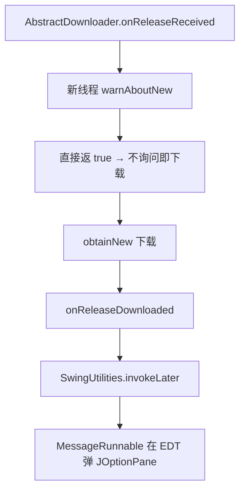

# 🧩 GuiDownloader

<Badge type="tip" text="更新子系统" /> <Badge type="info" text="模板方法子类" />

> GUI 下载器：warnAboutNew 直接返 true（不问），下载完成在 EDT 上弹 JOptionPane——无确认直接下载，Swing 线程安全。

📁 源码：<code>ClassySharkWS/src/com/google/classyshark/updater/networking/GuiDownloader.java</code> &nbsp; 📦 包：<code>com.google.classyshark.updater.networking</code>

## 职责

`GuiDownloader` 是 `AbstractDownloader` 的 Swing 实现，单例。`warnAboutNew(Release)` 直接返回 `true`——不询问用户，检测到新版本即下载。`onReleaseDownloaded(File, Release)` 通过 `SwingUtilities.invokeLater(new MessageRunnable(...))` 在 EDT（事件分发线程）上弹出含标题与 changelog 的 `JOptionPane` 更新提示。Swing 弹窗逻辑封装在 `MessageRunnable` 中，保证线程安全。

## 关键方法 / 字段

| 名称 | 类型 | 说明 |
|------|------|------|
| `instance` | private static final AbstractDownloader | 单例 |
| `getInstance()` | static AbstractDownloader | 返回单例 |
| `warnAboutNew(Release)` | boolean | 直接返回 true（不问） |
| `onReleaseDownloaded(File, Release)` | void | EDT 上 invokeLater MessageRunnable |

## 工作流程

## 设计要点

- ⚡ **无确认直接下载** — 与 CLI 的 y/N 询问不同，GUI 直接下载并在完成后通知，适合桌面应用静默更新体验。
- 🧵 **EDT 线程安全** — Swing 组件操作必须 EDT，`invokeLater` 把弹窗投递到事件分发线程。
- 🧱 **UI 逻辑外置** — 弹窗文案与图标封装在 [[MessageRunnable]]，`GuiDownloader` 只负责调度。
- 🔁 **单例** — `private` 构造 + 静态 instance。

## 协作关系

- 继承：[[AbstractDownloader]]
- 依赖：[[Release]]、[[MessageRunnable]]（弹窗逻辑）
- 被调用：[[UpdateManager]]（`getDownloaderFrom(true)`）

## 已知问题 / TODO

- 无确认即下载，用户无法拒绝更新（与 CLI 行为不对称）。
- 下载失败时（`AbstractDownloader.obtainNew` 吞 IOException）GUI 端无任何提示。

## 相关文档

- [更新子系统架构](/reference/architecture/updater)
- [GUI 指南](/gui/index)
