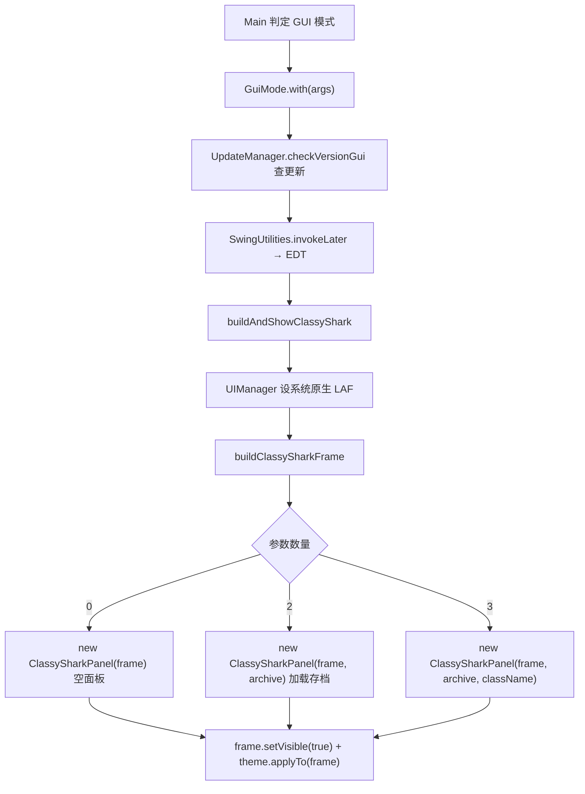

# 🧩 GuiMode

<Badge type="tip" text="GUI 入口层" /> <Badge type="info" text="驱动类" />

> GUI 模式入口，在 EDT 上构建并展示 ClassyShark 主窗口与中央面板。

📁 源码：<code>ClassySharkWS/src/com/google/classyshark/gui/GuiMode.java</code> &nbsp; 📦 包：<code>com.google.classyshark.gui</code>

## 职责

`GuiMode` 是 ClassyShark 图形界面模式的驱动类，相对 CLI 模式而存在。它由 `Main` 在判定走 GUI 后调用 `with(argsAsArray)`：先触发更新检查，再通过 `SwingUtilities.invokeLater` 把窗口构建切到事件分发线程（EDT）上执行。它还作为主题的缓存入口，`getTheme()` 返回启动时缓存的 `ThemeManager.getCurrentTheme()`，供各面板共享同一主题实例。

## 关键方法 / 字段

| 名称 | 类型 | 说明 |
|------|------|------|
| `theme` | static Theme | 启动时缓存的当前主题（`ThemeManager.getCurrentTheme()`） |
| `with(List<String>)` | static void | GUI 入口：查更新 + EDT 上构建主窗口 |
| `getTheme()` | static Theme | 返回缓存主题，供面板共享 |
| `buildAndShowClassyShark(List<String>)` | private static void | 设系统 LAF、构建并展示 JFrame |
| `buildClassySharkFrame(List<String>)` | private static JFrame | 按参数数量分发 `ClassySharkPanel` 构造重载 |
| `GuiMode()` | private | 私有构造，禁实例化 |

## 工作流程

## 设计要点

- 🎨 **系统原生 LAF 优先** — 先 `UIManager.setLookAndFeel(getSystemLookAndFeelClassName())` 设原生外观，再 `theme.applyTo(frame)` 用 ClassyShark 主题覆盖，保证窗口观感统一。
- 🧵 **EDT 安全** — 所有 Swing 构建都包在 `SwingUtilities.invokeLater` 内，避免线程违规。
- 🔢 **参数数量分发** — `buildClassySharkFrame` 按命令行参数数量（0/2/3）选择 `ClassySharkPanel` 的三个构造重载，分别对应空面板、加载存档、加载存档+定位类。
- 💾 **主题缓存** — `theme` 为 static 字段，启动时一次性读取，避免各面板各自重复读取主题管理器。
- 🔒 **私有构造** — 纯静态工具类风格，不可实例化。

## 协作关系

- 被调用 ← [[Main]]（GUI 模式入口分发）
- 依赖 → [[ClassySharkPanel]]（生产者：构建中央面板）
- 依赖 → [[ThemeManager]]（读取当前主题）
- 依赖 → `UpdateManager`（启动时检查版本更新）

## 已知问题 / TODO

- 无明显已知问题；分发逻辑依赖参数数量（位置参数），缺乏命名参数/选项解析的健壮性。

## 相关文档

- [入口层架构](/reference/architecture/entry-layer)
- [GUI 模式使用](/gui/index)
- [[Main]]
