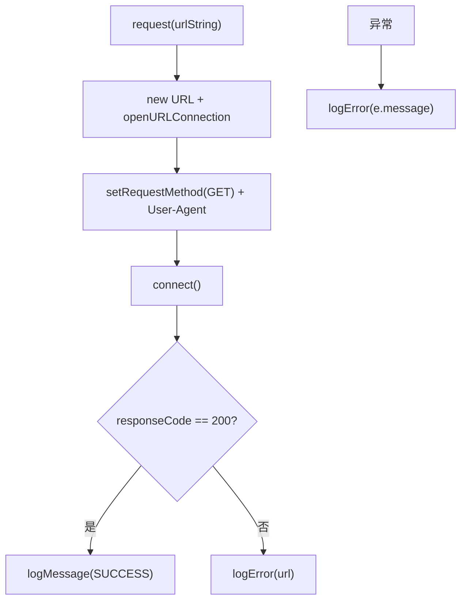

# 🧩 HTTPGetMethod

<Badge type="tip" text="分析子系统" /> <Badge type="info" text="HTTP 执行器" />

> 执行 HTTP GET 上报跟踪 URL：构造 Java User-Agent，响应非 200 记错误但不抛（静默失败）。

📁 源码：<code>ClassySharkWS/src/com/google/classyshark/analytics/HTTPGetMethod.java</code> &nbsp; 📦 包：<code>com.google.classyshark.analytics</code>

## 职责

`HTTPGetMethod` 负责对给定 URL 执行一次 HTTP GET 请求以完成跟踪上报。它在构造时延迟初始化 User-Agent 串（格式 `Java/<version> (<os.arch>; <os.name> <os.version>)`），`request(urlString)` 打开 `HttpURLConnection`、设 GET 方法与 User-Agent、连接并检查响应码：非 200 经 `LoggingAdapter` 记错误但不抛异常（静默失败），200 记成功消息。日志通过 `LoggingAdapter` 解耦，允许接入 log4j/System.out 等。

## 关键方法 / 字段

| 名称 | 类型 | 说明 |
|------|------|------|
| `GET_METHOD_NAME` | static final String | `GET` |
| `SUCCESS_MESSAGE` | static final String | 成功日志文案 |
| `loggingAdapter` | private LoggingAdapter | 可注入的日志适配器 |
| `uaName` | static String | 延迟初始化的 UA 名（`Java/<version>`） |
| `osString` | static String | OS 串（arch; name version） |
| `request(String)` | void | 执行 GET 上报，非 200 记错不抛 |
| `setLoggingAdapter(LoggingAdapter)` | void | 注入日志适配器 |
| `getResponseCode(HttpURLConnection)` | protected int | 可重写的响应码获取（便于测试） |

## 工作流程

## 设计要点

- 🤐 **静默失败** — 响应非 200 或抛异常只记错误日志，不向上传播，保证主应用不受上报失败影响。
- 🔧 **延迟静态初始化 UA** — 构造时若 `uaName == null` 才初始化，且 UA 串静态共享。
- 🔌 **日志解耦** — 经 `LoggingAdapter` 输出，可注入任意日志实现。
- 🧪 **可测试钩子** — `getResponseCode` 与 `openURLConnection` 为 protected/private，便于子类/测试覆写。

## 协作关系

- 依赖：[[LoggingAdapter]]（日志接口）
- 被调用：[[JGoogleAnalyticsTracker]]（`httpRequest.request(...)`）

## 已知问题 / TODO

- User-Agent 与 OS 串静态共享，多实例间不隔离（设计上单进程只初始化一次）。
- 无重试机制，网络抖动直接记错放弃。

## 相关文档

- [分析子系统架构](/reference/architecture/analytics)
