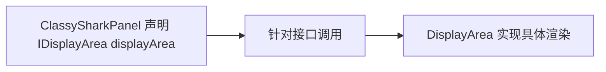

# 🧩 IDisplayArea

<Badge type="tip" text="GUI 契约层" /> <Badge type="info" text="接口" />

> DisplayArea 实现的显示区接口，声明组件访问器与多种显示方法。

📁 源码：<code>ClassySharkWS/src/com/google/classyshark/gui/panel/displayarea/IDisplayArea.java</code> &nbsp; 📦 包：<code>com.google.classyshark.gui.panel.displayarea</code>

## 职责

`IDisplayArea` 是 `DisplayArea` 实现的接口，声明了组件访问器 `onAddComponentToPane` 与 6 种显示方法。它让 `ClassySharkPanel` 能针对接口编程（`IDisplayArea displayArea`），简化成员声明，便于替换或测试显示区实现。

## 关键方法 / 字段

| 名称 | 类型 | 说明 |
|------|------|------|
| `onAddComponentToPane()` | Component | 返回底层 Swing 组件 |
| `displayClassNames(List, String)` | void | 显示类名列表（带输入高亮） |
| `displayClass(List<ELEMENT>, String)` | void | 按标记显示类源 |
| `displayClass(String)` | void | 单色显示类 |
| `displaySharkey()` | void | 显示欢迎涂鸦 |
| `displayError()` | void | 显示错误 |
| `displaySearchResults(List, List, String)` | void | 显示搜索结果 |

## 工作流程

## 设计要点

- 🪜 **面向接口** — 中介者只见接口，不绑死具体 `DisplayArea` 类。
- 🧾 **方法集合即能力契约** — 6 种显示方法覆盖所有内容场景（类/列表/搜索/涂鸦/错误）。
- 🔁 **双 displayClass 重载** — 一个接收 `List<ELEMENT>` 带高亮，一个接收 `String` 单色，分别对应翻译后与原始字符串场景。

## 协作关系

- 实现 ← [[DisplayArea]]
- 被使用 ← [[ClassySharkPanel]]

## 已知问题 / TODO

- 无明显已知问题；接口稳定。

## 相关文档

- [GUI 架构](/reference/architecture/gui-layer)
- [[DisplayArea]]
