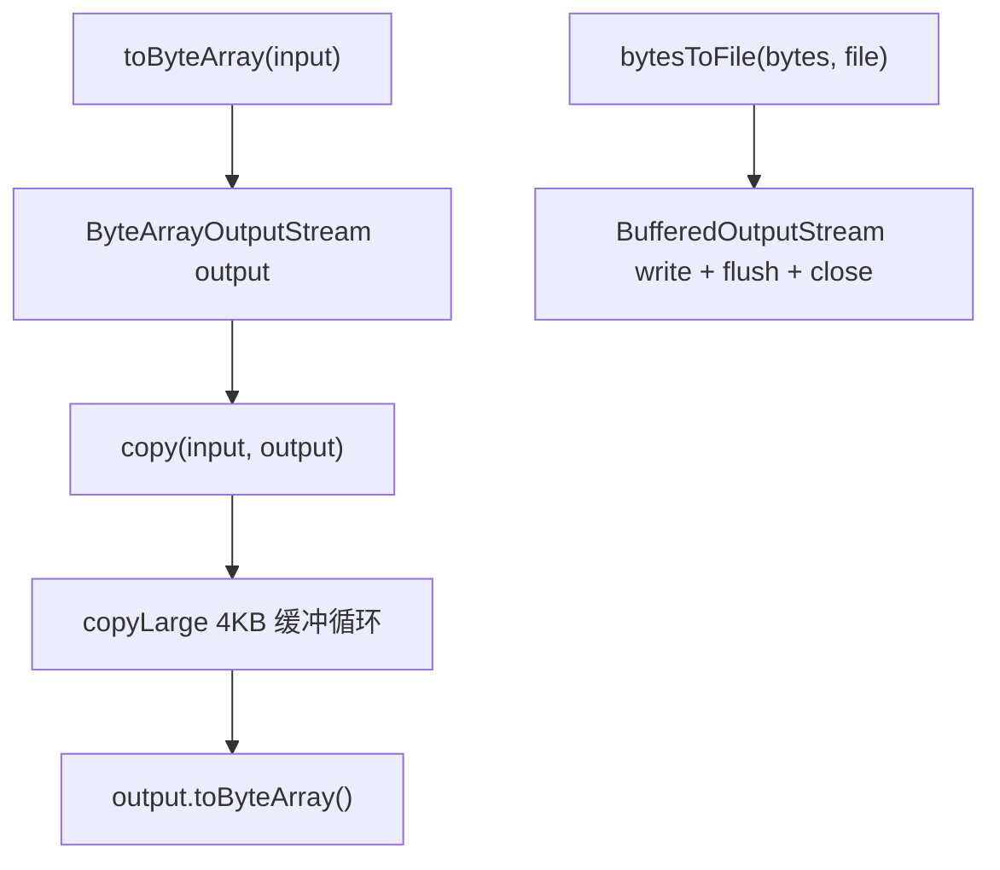

# 🧩 IOUtils

<Badge type="tip" text="Android 子系统" /> <Badge type="info" text="IO 工具" />

> IO 工具：`toByteArray`（InputStream→byte[]）、`bytesToFile`、`copy`/`copyLarge`——Apache Commons IO 风格精简实现。

📁 源码：<code>ClassySharkAndroid/app/src/main/java/com/google/classysharkandroid/utils/IOUtils.java</code> &nbsp; 📦 包：<code>com.google.classysharkandroid.utils</code>

## 职责

`IOUtils` 是 ClassySharkAndroid 的 IO 工具类，提供静态方法：`toByteArray(InputStream)` 把输入流读成字节数组（经 `copy` 转 `ByteArrayOutputStream`），`bytesToFile(byte[], File)` 把字节写入文件，`copy(InputStream, OutputStream)` 与 `copyLarge` 用标准 4KB 缓冲循环拷贝。这是 Apache Commons IO 风格的精简本地实现，避免引入完整第三方库。

## 关键方法 / 字段

| 名称 | 类型 | 说明 |
|------|------|------|
| `DEFAULT_BUFFER_SIZE` | private static final int | `1024 * 4` = 4KB |
| `toByteArray(InputStream)` | static byte[] | 流→字节（经 copy） |
| `bytesToFile(byte[], File)` | static void | 字节→文件 |
| `copy(InputStream, OutputStream)` | static int | 拷贝，返回字节数（超 MAX_VALUE 返 -1） |
| `copyLarge(InputStream, OutputStream)` | static long | 4KB 缓冲循环拷贝，返回 long 字节计数 |

## 工作流程

## 设计要点

- 📦 **Apache Commons IO 风格** — `toByteArray`/`copy`/`copyLarge` 命名与语义对齐 Commons IO，本地精简实现。
- 🪣 **4KB 标准缓冲** — `DEFAULT_BUFFER_SIZE = 1024 * 4`，IO 拷贝经典缓冲大小。
- 🔢 **long 计数** — `copyLarge` 返回 long 防溢出，`copy` 转 int（超 `Integer.MAX_VALUE` 返 -1）。
- 🧱 **纯静态工具** — 无实例字段，全静态方法。

## 协作关系

- 依赖：无
- 被调用：[[ClassesListActivity]]（toByteArray 读 APK 字节、bytesToFile 写临时 dex）、[[DexLoaderBuilder]]（fromFile 用 toByteArray）

## 已知问题 / TODO

- `bytesToFile` 的 `BufferedOutputStream` 在异常路径下未关闭（资源泄漏）。
- `copy`/`copyLarge` 不关闭传入的流（调用方负责，但易遗漏）。
- 无 `closeQuietly` 风格的容错关闭工具。

## 相关文档

- [Android 子系统架构](/reference/architecture/android)
