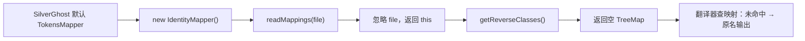

# 🧩 IdentityMapper

<Badge type="tip" text="插件" /> <Badge type="info" text="恒等映射" />

> `TokensMapper` 的恒等映射实现，`readMappings` 返回自身，是混淆/反混淆映射链中的"无操作"节点。

📁 源码：<code>ClassySharkWS/src/com/google/classyshark/silverghost/plugins/IdentityMapper.java</code> &nbsp; 📦 包：<code>com.google.classyshark.silverghost.plugins</code>

## 职责

`IdentityMapper` 实现 `TokensMapper` 接口，提供"什么也不映射"的默认实现。`readMappings` 直接返回 `this`（不读取任何映射文件），`getReverseClasses` 返回一个空的 `TreeMap`。在混淆/反混淆映射链中，它充当无操作节点，可与有真实映射的 Mapper 互换，使调用方在"有映射"与"无映射"两种情形下走同一套代码路径。它是 `SilverGhost` 的默认 `TokensMapper`。

## 关键方法 / 字段

| 名称 | 类型 | 说明 |
|------|------|------|
| `identityMap` | private Map&lt;String, String&gt; | 空 TreeMap，作为"反向类映射"默认值 |
| `IdentityMapper()` | 构造器 | 无参，无任何初始化 |
| `readMappings(File)` | TokensMapper | 恒等：忽略文件，返回 `this` |
| `getReverseClasses()` | Map&lt;String, String&gt; | 返回空 `TreeMap` |

## 工作流程

## 设计要点

- 🪞 **恒等语义** — `readMappings` 返回 `this`，`getReverseClasses` 返回空表，任何查映射都"未命中"，等价于不映射。
- 🔄 **链中可互换** — 与有真实映射的 `TokensMapper` 实现接口相同，可在映射链中无缝替换，调用方零改动。
- 🌳 **TreeMap 空容器** — 返回有序空 Map，下游若依赖排序遍历也不会出错。
- 🏠 **SilverGhost 默认** — 当未提供外部映射文件时，`SilverGhost` 用此实现作为默认 mapper，保证翻译器始终能拿到一个非 null 的 mapper。
- 🚫 **文件无关** — `readMappings` 完全忽略传入的 `File` 参数，无 IO、无状态。

## 协作关系

- 实现 → [[TokensMapper]]（策略接口）
- 被调用 ← [[SilverGhost]]（作为默认 TokensMapper）
- 可替换 ← 其他有真实映射的 `TokensMapper` 实现
- 喂给 → [[Translator]]（`addMapper` 接收）

## 已知问题 / TODO

- 无明显已知问题。恒等映射即其设计目的。

## 相关文档

- [插件子系统](/reference/architecture/plugins)
- [翻译器层](/reference/architecture/translator)
