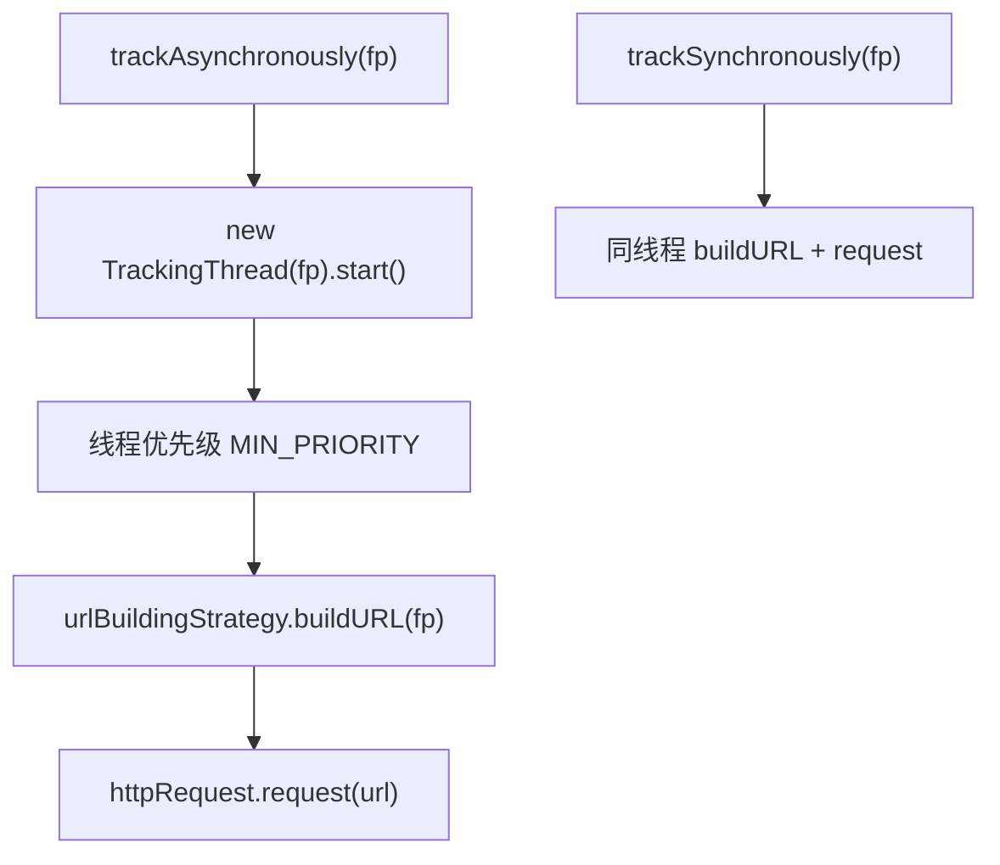

# 🧩 JGoogleAnalyticsTracker

<Badge type="tip" text="分析子系统" /> <Badge type="info" text="核心跟踪器" />

> 核心跟踪器：组合 URL 构建策略与 HTTP 执行器，提供同步与异步（低优先级后台线程）两种上报方式。

📁 源码：<code>ClassySharkWS/src/com/google/classyshark/analytics/JGoogleAnalyticsTracker.java</code> &nbsp; 📦 包：<code>com.google.classyshark.analytics</code>

## 职责

`JGoogleAnalyticsTracker` 是分析子系统的核心类，组合 `URLBuildingStrategy`（URL 构建）与 `HTTPGetMethod`（HTTP 执行）。它提供 `trackSynchronously(FocusPoint)`（同步上报，阻塞当前线程）和 `trackAsynchronously(FocusPoint)`（异步上报，内部起一个 `TrackingThread`，优先级设为 `MIN_PRIORITY` 以避免影响主应用性能）。构造时默认装配 `GoogleAnalytics_v1_URLBuildingStrategy`，可通过 setter 注入其他策略与日志适配器。基于第三方 jgoogleanalytics（Siddique Hameed）。

## 关键方法 / 字段

| 名称 | 类型 | 说明 |
|------|------|------|
| `urlBuildingStrategy` | private URLBuildingStrategy | URL 构建策略 |
| `httpRequest` | private HTTPGetMethod | HTTP 执行器（构造时实例化） |
| `loggingAdapter` | private LoggingAdapter | 可注入日志适配器 |
| `JGoogleAnalyticsTracker(app, code)` | 构造器 | 应用名 + 跟踪码 |
| `JGoogleAnalyticsTracker(app, ver, code)` | 构造器 | 应用名 + 版本 + 跟踪码 |
| `setUrlBuildingStrategy(...)` | void | setter 注入策略 |
| `setLoggingAdapter(...)` | void | setter 注入日志（同时传给 httpRequest） |
| `trackSynchronously(FocusPoint)` | void | 同步上报 |
| `trackAsynchronously(FocusPoint)` | void | 异步上报（MIN_PRIORITY 线程） |
| `TrackingThread` | 内部类 | 低优先级后台线程执行 request |

## 工作流程

## 设计要点

- 🧵 **异步低优先级** — `TrackingThread` 设 `Thread.MIN_PRIORITY`，避免上报线程抢占主应用 CPU。
- 🔌 **setter 注入** — 策略与日志适配器均可运行时替换，灵活性高。
- 🧱 **组合两个策略** — URL 构建与 HTTP 执行分离，各自可独立替换/测试。
- 📜 **基于 jgoogleanalytics** — 注释 `@see JGoogleAnalytics.googlecode.com`，原作者 Siddique Hameed。
- ⚠️ **同步上报警告** — `trackSynchronously` Javadoc 警告有性能影响，仅在必要时使用。

## 协作关系

- 依赖：[[URLBuildingStrategy]]、[[GoogleAnalytics_v1_URLBuildingStrategy]]（默认策略）、[[HTTPGetMethod]]、[[FocusPoint]]、[[LoggingAdapter]]
- 被调用：[[Analytics]]（addActivation 异步上报）

## 已知问题 / TODO

- `TrackingThread` 每次 track 新建线程，无线程池，高频上报会创建大量短命线程。
- 默认使用已废弃的 GA v1 协议（见 [[GoogleAnalytics_v1_URLBuildingStrategy]]）。

## 相关文档

- [分析子系统架构](/reference/architecture/analytics)
