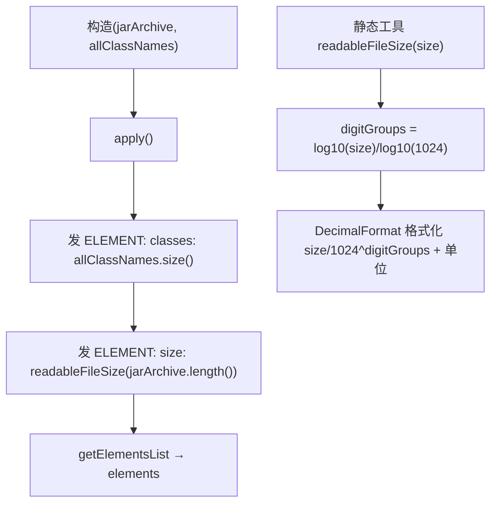

# 🧩 JarInfoTranslator

<Badge type="tip" text="Translator 核心" /> <Badge type="info" text="Translator 实现" />

> jar 摘要视图翻译器：发出类计数与人类可读的文件大小。

📁 源码：<code>ClassySharkWS/src/com/google/classyshark/silverghost/translator/jar/JarInfoTranslator.java</code> &nbsp; 📦 包：<code>com.google.classyshark.silverghost.translator.jar</code>

## 职责

`JarInfoTranslator` 实现 `Translator`，是 jar 条目的极简摘要视图。`apply` 只发两个 `ELEMENT`：类计数（来自构造时传入的 `allClassNames.size()`）与人类可读的文件大小（`readableFileSize(jarArchive.length())`）。它不遍历单个类——类的详情来自外部已经收集好的 `allClassNames` 列表。此外它对外暴露静态工具 `readableFileSize(long)`，把字节数格式化为 B/KB/MB/GB/TB，被 `ElfTranslator` 与 `DexInfoTranslator` 复用。

## 关键方法 / 字段

| 名称 | 类型 | 说明 |
|------|------|------|
| `jarArchive` | final File | jar 文件 |
| `allClassNames` | final List&lt;String&gt; | 预先收集的全部类名（供计数） |
| `elements` | List&lt;ELEMENT&gt; | 解码结果缓冲 |
| `getClassName()` | String | 返回 `jarArchive.getName()` |
| `addMapper(TokensMapper)` | void | 空操作 |
| `apply()` | void | 发类计数 + 可读文件大小两个元素 |
| `getElementsList()` | List&lt;ELEMENT&gt; | 返回 `elements` |
| `getDependencies()` | List&lt;String&gt; | 返回空 `LinkedList` |
| `readableFileSize(long size)` | static String | 工具：格式化字节数为 B/KB/MB/GB/TB |

## 工作流程

## 设计要点

- 🧩 **极简摘要** — 不遍历 jar 内单个类，仅输出聚合的类计数与文件大小，详情由外部 `allClassNames` 承载。
- 📊 **通用体积格式化** — `readableFileSize` 用 `Math.log10` 计算 `digitGroups`（1024 进制），`DecimalFormat("#,##0.#")` 输出一位小数，覆盖 B 到 TB 五档。
- ♻️ **跨翻译器复用** — 该静态方法被 `ElfTranslator`（`static import`）与 `DexInfoTranslator`（直接调用）复用，成为事实上的体积格式化标准。
- 🏷️ **用 ANNOTATION 标签** — 两段摘要都标为 `TAG.ANNOTATION`，UI 着色时与 dex info 的 `MODIFIER/DOCUMENT` 区分。
- 🧹 **空操作的 mapper/dependencies** — 摘要视图不需要反混淆映射与依赖列表。

## 协作关系

- 依赖：[[Translator]]（实现接口）
- 被复用：[[ElfTranslator]]（`readableFileSize`，static import）
- 被复用：[[DexInfoTranslator]]（`readableFileSize`，直接调用）
- 被创建：[[TranslatorFactory]]（`.jar` 分支，传入 `allClassNames`）
- 被调用：[[DisplayArea]]（消费 `getElementsList()`）

## 已知问题 / TODO

- ⚠️ `readableFileSize` 对 `size <= 0` 返回 `"0"`（无单位），与正数路径（带单位）输出风格不一致。
- ⚠️ `digitGroups` 未做上界保护，若 `size` 极大（超过 TB）会越界访问 `units` 数组（理论上对真实 jar 不会触发）。
- 无功能性 bug。

## 相关文档

- [Translator 核心架构](/reference/architecture/translator-core)
- [模块索引](/reference/modules/Main)
