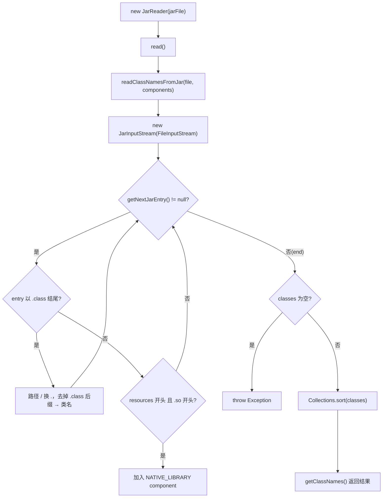

# 🧩 JarReader

<Badge type="tip" text="内容读取子系统" /> <Badge type="info" text="策略实现" />

> JAR 读取器：流式遍历 JarEntry，把 `.class` 条目名转类名，并尝试检测 native library。

📁 源码：<code>ClassySharkWS/src/com/google/classyshark/silverghost/contentreader/jar/JarReader.java</code> &nbsp; 📦 包：<code>com.google.classyshark.silverghost.contentreader.jar</code>

## 职责

`JarReader` 读取 JAR 内类名与 native 库成分。核心是静态方法 `readClassNamesFromJar`：用 `JarInputStream` 流式遍历每个 `JarEntry`，对 `.class` 条目把路径分隔符 `/` 换成 `.` 并去掉 `.class` 后缀得到类名；同时尝试识别 native library 条目加入 components。结果排序返回。若一个类都没读到则抛异常。静态方法被 `AarReader` 复用以解析 AAR 内嵌的 classes.jar。

## 关键方法 / 字段

| 名称 | 类型 | 说明 |
|------|------|------|
| `binaryArchive` | protected File | 待读取的 jar 文件 |
| `allClassNames` | protected List&lt;String&gt; | 类名结果 |
| `components` | private List&lt;Component&gt; | native lib 成分 |
| `JarReader(File)` | ctor | 保存 binaryArchive |
| `read()` | void | 调 `readClassNamesFromJar`，异常打栈，结果排序 |
| `getClassNames()` | List&lt;String&gt; | 返回 allClassNames |
| `getComponents()` | List&lt;Component&gt; | 返回 components |
| `readClassNamesFromJar(File, List<Component>)` | static | 流式遍历 jar，提取类名与 native lib；空则抛异常 |

## 工作流程

## 设计要点

- **流式读取** — `JarInputStream.getNextJarEntry()` 逐条遍历，内存占用低。
- **类名转换** — `replaceAll("/", ".")` 后 `substring(0, lastIndexOf('.'))` 去掉 `.class`，得到点分全限定名。
- **静态方法可复用** — `readClassNamesFromJar` 接受外部 `components` 列表就地填充，供 `AarReader` 直接复用（AAR 内嵌 jar 走临时文件桥接）。
- **空 jar 报错** — `classes.isEmpty()` 时 `throw new Exception()`，避免返回空列表被误当成功。
- **protected 字段** — `binaryArchive`/`allClassNames` 设为 protected，便于子类或同包扩展。

## 协作关系

- 实现 → [[BinaryContentReader]]
- 被 [[ContentReader]] 在 `.jar` 分支实例化
- 被 [[AarReader]] 复用 `readClassNamesFromJar`

## 已知问题 / TODO

- ⚠️ **native lib 检测逻辑错误** — 条件为 `getName().startsWith("resources") && getName().startsWith(".so")`，一个名字不可能同时以 `resources` 和 `.so` 开头，该条件恒为 false，native lib 永远识别不到。应为 `endsWith(".so")` 且限定 `lib/` 或 `resources/` 路径。注释 `// TODO add checking` 也印证尚未完成。
- `readClassNamesFromJar` 抛的是裸 `Exception`，`read()` 只打栈不传递，调用方无法区分「空 jar」与「IO 异常」。

## 相关文档

- [内容读取子系统](/reference/architecture/content-reader)
