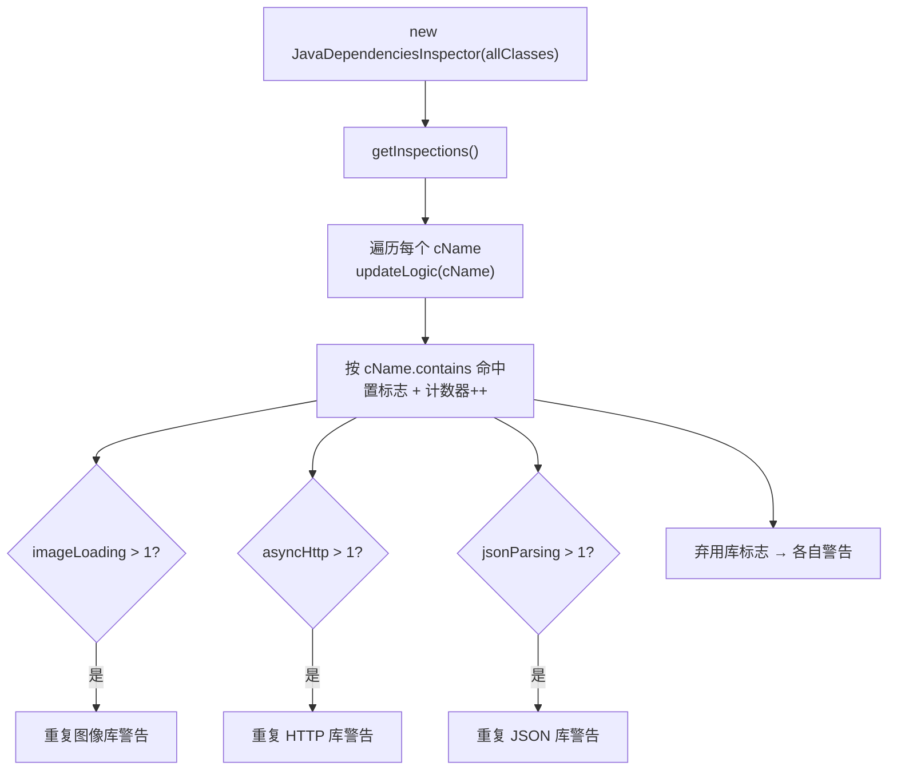

# 🧩 JavaDependenciesInspector

<Badge type="tip" text="APK Dashboard" /> <Badge type="info" text="检查器" />

> 扫描类名列表检测已知第三方库，标记重复库与弃用库的使用。

📁 源码：<code>ClassySharkWS/src/com/google/classyshark/silverghost/translator/apk/dashboard/JavaDependenciesInspector.java</code> &nbsp; 📦 包：<code>com.google.classyshark.silverghost.translator.apk.dashboard</code>

## 职责

`JavaDependenciesInspector` 接收 APK 的全部类名列表，对每个类名做纯子串匹配，识别三类问题：重复图像加载库（Glide/Picasso/Fresco）、重复异步 HTTP（OkHttp/Volley/Loopj）、重复 JSON 解析（Jackson/Gson/Moshi），以及一系列弃用库（Guava、Apache Http、ActionBarSherlock、PullToRefresh、ViewPagerIndicator）。`getInspections()` 遍历全部类名更新计数与标志，最后按计数 >1 触发重复警告、按标志触发弃用警告。

## 关键方法 / 字段

| 名称 | 类型 | 说明 |
|------|------|------|
| `allClasses` | List&lt;String&gt; | 全部类名，检查输入 |
| `imageLoading` / `asyncHttp` / `jsonParsing` | int | 三类库各自计数器 |
| `hasGlide/hasPicasso/hasFresco` | boolean | 图像库存在标志 |
| `hasOkHttp/hasVolley/hasLoopj` | boolean | HTTP 库存在标志 |
| `hasJackson/hasGson/hasMoshi` | boolean | JSON 库存在标志 |
| `hasGuava/hasDeprecatedHttp/...` | boolean | 弃用库标志 |
| `getInspections()` | List&lt;String&gt; | 遍历类名 + 触发各警告 |
| `updateLogic(String)` | private void | `cName.contains(...)` 子串匹配分支 |

## 工作流程

## 设计要点

- 🔍 **纯子串匹配** — `updateLogic` 全靠 `cName.contains("glide")` 这类子串判断，无字节码/包元数据分析，简单但有误报风险。
- 🔢 **计数器 + 标志分离** — 每类库用「计数器 + 每库布尔标志」组合：计数器判是否重复，标志拼进警告字符串，逻辑清晰。
- ⚠️ **仅在 >1 报重复** — `imageLoading`/`asyncHttp`/`jsonParsing` 计数大于 1 才输出重复警告，单一库不报。
- 📋 **弃用库硬编码** — Guava/Apache Http/ActionBarSherlock/PullToRefresh/ViewPagerIndicator 的规则写死在 `updateLogic`，无扩展插槽。
- 🐛 **匹配串瑕疵** — `"'com.actionbarsherlock"` 前导单引号是疑似笔误，正常类名不会以单引号开头，该规则实际可能永不命中。

## 协作关系

- 被 [[ApkDashboard]] 的 `getJavaDependenciesErrors()` 调用
- 输入 `allClasses` 来自 [[MultidexReader]] 填充

## 已知问题 / TODO

- `cName.contains("'com.actionbarsherlock")` 含前导单引号，疑似笔误，该弃用库检测可能失效。
- 规则表硬编码，无法在不改源码的情况下扩展新库。
- 子串匹配易误报（例如含 `http` 的无关类名）。

## 相关文档

- [APK Dashboard 架构](/reference/architecture/apk-dashboard)
- [依赖检查](/reference/architecture/apk-dashboard)
