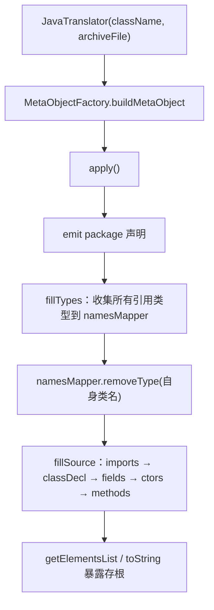

# 🧩 JavaTranslator

<Badge type="tip" text="Java Translator" /> <Badge type="info" text="策略模式" />

> 把单个类（jar/class/dex/apk/aar）渲染成类 Java 源码存根的主 Translator 实现。

📁 源码：<code>ClassySharkWS/src/com/google/classyshark/silverghost/translator/java/JavaTranslator.java</code> &nbsp; 📦 包：<code>com.google.classyshark.silverghost.translator.java</code>

## 职责

`JavaTranslator` 实现 `Translator` 接口，是一个纯函数式映射：`(className, archiveFile) → 带标签的源码 token 列表`。它通过 `MetaObjectFactory` 取得该类的元对象，然后两阶段（先收集类型、再发射源码）把元数据渲染成类 Java 源码存根，同时维护一份导入列表供 `getDependencies` 返回。它还支持通过 `addMapper` 在元对象外再包一层 ProGuard 反混淆装饰器。

## 关键方法 / 字段

| 名称 | 类型 | 说明 |
|------|------|------|
| `metaObject` | MetaObject | 被渲染类的元对象，由 `MetaObjectFactory.buildMetaObject` 构造 |
| `sourceCode` | List&lt;ELEMENT&gt; | 渲染出的带标签 token 列表，`toString` 拼接为源码 |
| `namesMapper` | QualifiedTypesMap | 全限定名→短名映射，兼作导入列表 |
| `JavaTranslator(Class)` | 构造器 | 测试用，直接包装反射元对象 `MetaObjectClass` |
| `JavaTranslator(String, File)` | 构造器 | 生产用，委托 `MetaObjectFactory` 按存档类型选子类 |
| `apply()` | void | 两阶段渲染：`fillTypes` 收集引用类型，再 `fillSource` 发射源码 |
| `addMapper(TokensMapper)` | void | 用 `MetaObjectWithMapper` 包装元对象，做 ProGuard 反混淆 |
| `getDependencies()` | List&lt;String&gt; | 返回 `namesMapper` 的完整类型集，即导入列表 |
| `fillTypes(...)` | private void | 把接口/字段/构造器/方法的类型收集进 `namesMapper` |
| `fillSource(...)` | private void | 依次调用 fillImports/fillClassDecl/fillFields/fillCtors/fillMethods |
| `testJar/testSystemClass/testCustomClass/testInnerClass` | static void | 4 个测试入口，在 `main` 中依次调用 |

## 工作流程

## 设计要点

- **两阶段渲染** — 先 `fillTypes` 收集所有引用类型到 `QualifiedTypesMap`，再 `fillSource` 发射；这样导入列表与短名替换可在第二阶段统一查表。
- **自身类名剔除** — `apply` 中先 `namesMapper.removeType(className)`，避免类自身出现在 import 中；类名取短名时用 `getTypeNull`（查找但不存）。
- **字母序排序** — `fillFields`/`fillMethods` 用 `Collections.sort` 排序，依赖 `FieldInfo`/`MethodInfo` 的 `Comparable` 实现（按 `name` 字母序）。
- **存根而非真实体** — 方法与构造器一律发 `{ ... }` 空体，只呈现签名层信息，不还原方法体。
- **反混淆切入点** — `addMapper` 在元对象外包装 `MetaObjectWithMapper`，仅 `getName` 被反向映射，使类声明和 import 键使用反混淆后的名字。

## 协作关系

- 实现 → [[Translator]]（接口）
- 依赖 → [[MetaObjectFactory]]（构造元对象）
- 依赖 → [[MetaObject]]（元对象抽象）
- 依赖 → [[QualifiedTypesMap]]（类型映射与导入列表）
- 依赖 → [[MetaObjectWithMapper]]（反混淆装饰）
- 依赖 → [[MetaObjectClass]]（反射构造器分支）
- 被 [[TranslatorFactory]] 创建

## 已知问题 / TODO

- 类内含 4 个 `testXxx` 静态方法与 `main`，硬编码桌面测试路径（`~/Desktop/...`），属测试残留，非生产代码。
- `fillCtors`/`fillMethods` 对类型用 `getTypeNull`（不存）而参数用 `getType`（存），两者行为不一致，存在 import 收集边界的隐含取舍。

## 相关文档

- [Java Translator 子系统](/reference/architecture/java-translator)
- [翻译器工厂](/reference/modules/MetaObjectFactory)
