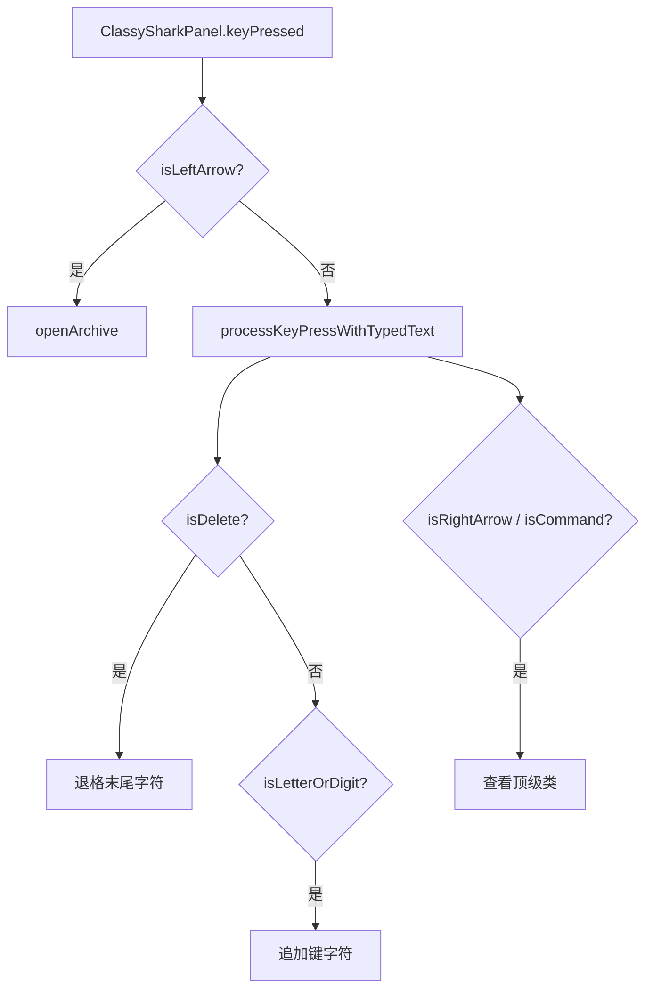

# 🧩 KeyUtils

<Badge type="tip" text="GUI 工具栏层" /> <Badge type="info" text="静态工具" />

> KeyEvent 分类静态工具，驱动键盘导航。

📁 源码：<code>ClassySharkWS/src/com/google/classyshark/gui/panel/toolbar/KeyUtils.java</code> &nbsp; 📦 包：<code>com.google.classyshark.gui.panel.toolbar</code>

## 职责

`KeyUtils` 是纯静态工具类，提供 `KeyEvent` 的分类判定：Delete、左/右方向、Command 键、字母数字。由 `ClassySharkPanel.keyPressed` 驱动键盘导航——左键打开存档、右键/Cmd 查看顶级类、字母数字追加过滤、Delete 退格。

## 关键方法 / 字段

| 名称 | 类型 | 说明 |
|------|------|------|
| `isDeletePressed(KeyEvent)` | static boolean | 键码 8 |
| `isLeftArrowPressed(KeyEvent)` | static boolean | 键码 37 |
| `isRightArrowPressed(KeyEvent)` | static boolean | 键码 39 |
| `isCommandKeyPressed(KeyEvent)` | static boolean | 键码 157 |
| `isLetterOrDigit(KeyEvent)` | static boolean | `Character.isLetterOrDigit` |
| `KeyUtils()` | private | 私有构造 |

## 工作流程

## 设计要点

- 🔢 **原始键码** — 用数字字面量 8/37/39/157 判定，而非 `KeyEvent.VK_*` 常量。
- 🧰 **纯静态** — 私有构造，不可实例化。
- 🎯 **导航语义** — 与 `ClassySharkPanel` 配合定义键盘导航 DSL。

## 协作关系

- 被调用 ← [[ClassySharkPanel]]

## 已知问题 / TODO

- 🐛 **代码异味** — 用裸数字键码而非 `KeyEvent.VK_BACK_SPACE`(8)/`VK_LEFT`(37)/`VK_RIGHT`(39)/`VK_META`(157)，可读性差且跨平台键码风险。
- 🐛 `isCommandKeyPressed` 固定 157（Mac Command），不识别 Windows/Super 键的其他变体。

## 相关文档

- [GUI 架构](/reference/architecture/gui-layer)
- [[ClassySharkPanel]]
