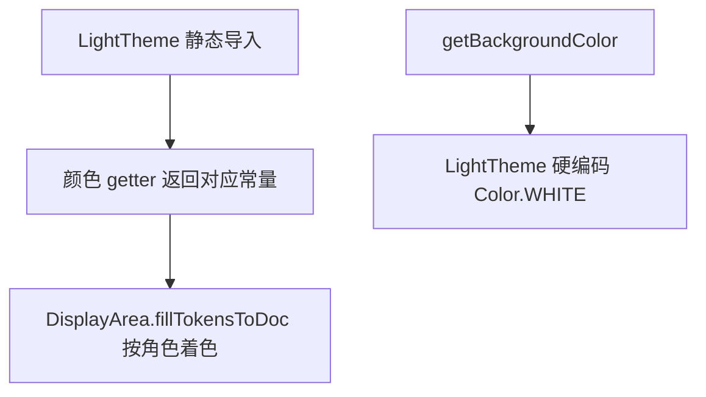

# 🧩 LightColorScheme

<Badge type="tip" text="主题子系统" /> <Badge type="info" text="调色板常量" />

> 浅色调色板：6 个 `Color` 常量（Solarized 风格浅色）的纯数据持有者，无背景常量。

📁 源码：<code>ClassySharkWS/src/com/google/classyshark/gui/theme/light/LightColorScheme.java</code> &nbsp; 📦 包：<code>com.google.classyshark.gui.theme.light</code>

## 职责

`LightColorScheme` 是浅色主题的颜色常量仓库，持有 6 个 `static final Color`：默认石板灰、关键字黄/橄榄、标识符绿橄榄、注解紫、选中背景蓝绿、名称浅石板灰。它是纯数据类，私有构造，仅供 `LightTheme` 静态导入使用。调色板呈 Solarized 浅色系列，与 `DarkColorScheme` 同色相系列调适白背景。注意无 `BACKGROUND` 常量——`LightTheme.getBackgroundColor` 直接返回 `Color.WHITE`。深浅两套调色板共用相同的 `SELECTION_BG` 蓝绿。

## 关键方法 / 字段

| 名称 | 类型 | 说明 |
|------|------|------|
| `DEFAULT` | static final Color | `(101,123,131)` 基础石板灰 |
| `KEYWORDS` | static final Color | `(181,137,0)` 黄/橄榄，关键字 |
| `IDENTIFIERS` | static final Color | `(133,153,0)` 绿橄榄，标识符 |
| `ANNOTATIONS` | static final Color | `(108,113,196)` 紫，注解 |
| `SELECTION_BG` | static final Color | `(7,56,66)` 蓝绿，选中背景（与深色相同） |
| `NAMES` | static final Color | `(147,161,161)` 浅石板灰，名称 |

## 工作流程

## 设计要点

- 🎨 **Solarized 浅色** — 与深色同色相系列（黄/绿/紫/蓝绿），调适白背景。
- 🆚 **共用 SELECTION_BG** — `SELECTION_BG(7,56,66)` 在深浅两套取值相同。
- 📦 **纯数据类** — 仅常量，私有构造，无逻辑。
- ❌ **无背景常量** — `LightTheme` 直接用 `Color.WHITE`，故本类不持 `BACKGROUND`。
- 🔒 **包级可见** — 类无 `public`，仅 light 包内 `LightTheme` 静态导入。

## 协作关系

- 依赖：无（纯常量）
- 被调用：[[LightTheme]]（静态导入所有常量）

## 已知问题 / TODO

- 无明显已知问题（纯常量数据类）。

## 相关文档

- [主题子系统架构](/reference/architecture/theme)
- [浅色主题调色板](/gui/themes)
