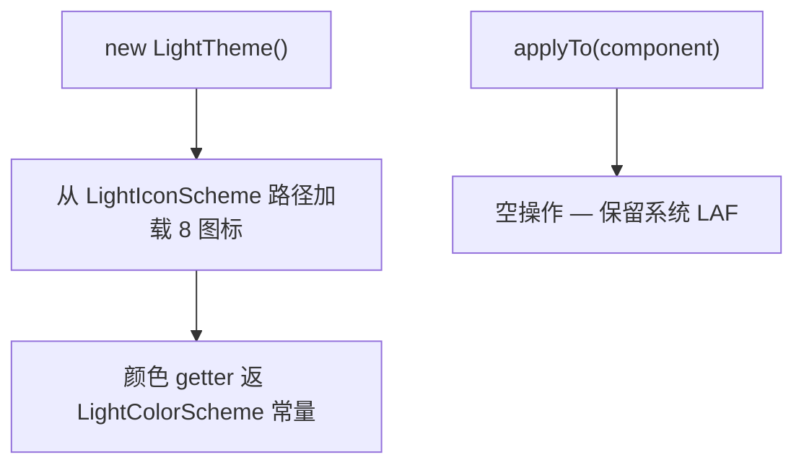

# 🧩 LightTheme

<Badge type="tip" text="主题子系统" /> <Badge type="info" text="具体主题" />

> 具体浅色主题：加载图标、颜色委托 LightColorScheme，applyTo 为空操作——刻意让系统原生 LAF 透出。

📁 源码：<code>ClassySharkWS/src/com/google/classyshark/gui/theme/light/LightTheme.java</code> &nbsp; 📦 包：<code>com.google.classyshark.gui.theme.light</code>

## 职责

`LightTheme` 是 `Theme` 契约的浅色实现。构造时从 `LightIconScheme` 路径加载 8 个图标（与深色同路径），颜色 getter 全部返回 `LightColorScheme` 常量，`getBackgroundColor` 硬编码返回 `Color.WHITE`。其 `applyTo(Component)` 是空操作——源码注释明言"不希望覆盖浅色主题的系统默认值"。这种与 `DarkTheme` 的非对称是刻意的：浅色外观让系统原生 Look & Feel 透出（故因平台而异），深色则处处相同地覆盖全部外观。

## 关键方法 / 字段

| 名称 | 类型 | 说明 |
|------|------|------|
| `toggleIcon` 等 8 个 | private final ImageIcon | 构造时从 LightIconScheme 路径加载 |
| `LightTheme()` | 构造器 | 仅加载图标，无 UI 默认设置 |
| `getDefaultColor()` | Color | 返回 `DEFAULT` 石板灰 |
| `getKeyWordsColor()` | Color | 返回 `KEYWORDS` 黄/橄榄 |
| `getIdentifiersColor()` | Color | 返回 `IDENTIFIERS` 绿橄榄 |
| `getBackgroundColor()` | Color | 硬编码 `Color.WHITE`（无 LightColorScheme 常量） |
| `applyTo(Component)` | void | 空操作（不覆盖系统默认） |

## 工作流程

## 设计要点

- ⚪ **applyTo 空操作** — 注释明言"不希望覆盖浅色主题的系统默认值"，让平台原生 LAF 透出。
- 🎨 **无 BACKGROUND 常量** — `getBackgroundColor` 直接返回 `Color.WHITE`，`LightColorScheme` 不持背景色。
- ⚖️ **刻意非对称** — 浅色外观因平台而异（依赖系统 LAF），深色处处同；这是设计选择而非疏漏。
- 🧷 **静态导入** — 颜色/图标路径全部 `static import`，与 `DarkTheme` 结构对称。

## 协作关系

- 依赖：[[Theme]]（实现）、[[LightColorScheme]]（颜色常量）、[[LightIconScheme]]（图标路径）
- 被调用：[[ThemeManager]]（显示索引 0 的实例）

## 已知问题 / TODO

- 与深色主题的 `applyTo` 非对称可能导致浅色下某些自定义组件外观不一致（依赖系统 LAF 渲染）。
- `getBackgroundColor` 硬编码 `Color.WHITE`，与 `LightColorScheme` 无背景常量设计不一致。

## 相关文档

- [主题子系统架构](/reference/architecture/theme)
- [浅色主题指南](/gui/themes)
