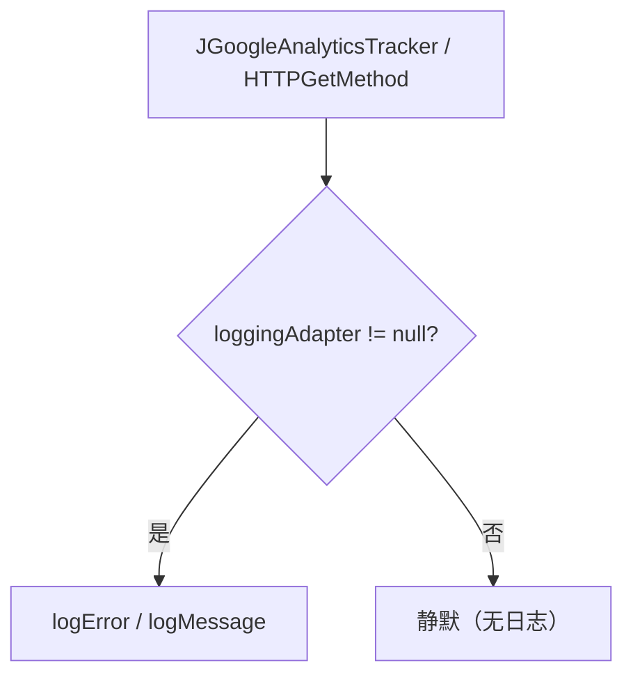

# 🧩 LoggingAdapter

<Badge type="tip" text="分析子系统" /> <Badge type="info" text="日志接口" />

> 日志接口：`logError` + `logMessage` 两方法，允许接入 log4j / System.out 等任意日志实现。

📁 源码：<code>ClassySharkWS/src/com/google/classyshark/analytics/LoggingAdapter.java</code> &nbsp; 📦 包：<code>com.google.classyshark.analytics</code>

## 职责

`LoggingAdapter` 是分析子系统的日志抽象接口，声明 `logError(String)` 与 `logMessage(String)` 两个方法。它把日志输出与跟踪逻辑解耦——调用方（`JGoogleAnalyticsTracker`、`HTTPGetMethod`）通过 setter 注入一个具体实现，可对接 log4j、`System.out` 或任意日志框架，而无需修改跟踪器代码。

## 关键方法 / 字段

| 名称 | 类型 | 说明 |
|------|------|------|
| `logError(String)` | void | 记录错误消息 |
| `logMessage(String)` | void | 记录普通消息 |

## 工作流程

## 设计要点

- 🪶 **极简两方法** — 错误与普通消息分流，足以覆盖跟踪场景的日志需求。
- 🔌 **策略抽象** — 实现可对接任意日志后端，跟踪代码不绑定具体框架。
- 🤐 **空实现即静默** — 不注入 adapter 时，调用方判空跳过，上报完全静默。

## 协作关系

- 依赖：无
- 被调用：[[JGoogleAnalyticsTracker]]（setLoggingAdapter）、[[HTTPGetMethod]]（setLoggingAdapter）

## 已知问题 / TODO

- 无明显已知问题（极简日志抽象接口）。

## 相关文档

- [分析子系统架构](/reference/architecture/analytics)
