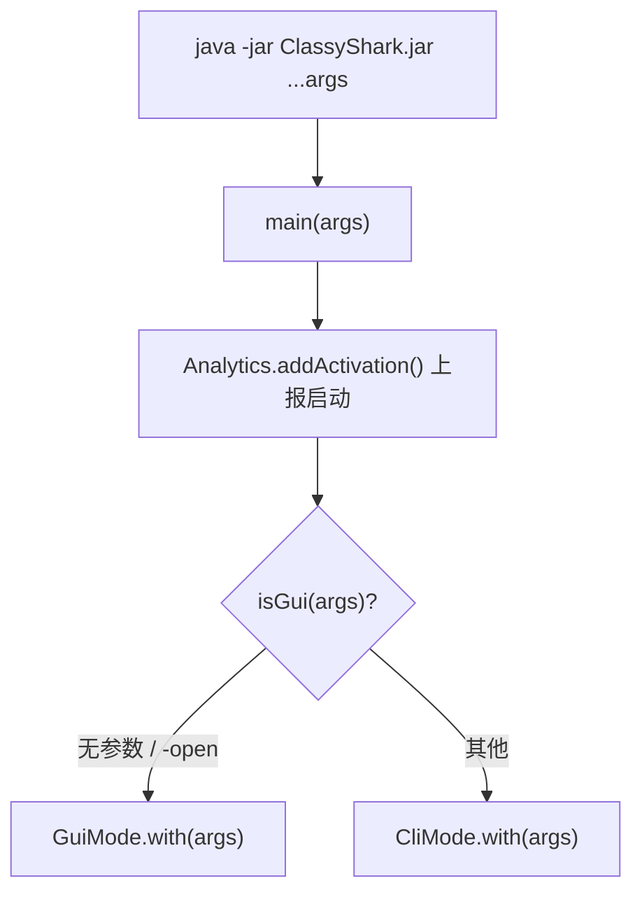

# 🧩 Main

<Badge type="tip" text="入口层" /> <Badge type="info" text="驱动类" />

> 程序的驱动类（driver class），根据命令行参数把控制流分发到 GUI 或 CLI 模式。

📁 源码：<code>ClassySharkWS/src/com/google/classyshark/Main.java</code> &nbsp; 📦 包：<code>com.google.classyshark</code>

## 职责

`Main` 是 ClassyShark 可执行 JAR 的入口点（`build.gradle` 中 `Main-Class: com.google.classyshark.Main`）。它读取命令行参数，判断用户要图形界面还是命令行模式，然后把控制流交给对应的模式处理器。它还负责在启动时触发一次匿名使用统计上报（`Analytics.INSTANCE.addActivation()`）。

## 关键方法 / 字段

| 名称 | 类型 | 说明 |
|------|------|------|
| `main(String[] args)` | static void | JAR 入口，分发到 GUI/CLI |
| `isGui(List<String>)` | private static boolean | 判断是否走 GUI：无参数或首参为 `-open` |
| `argsAsArray` | List&lt;String&gt; | 命令行参数列表 |

## 工作流程

## 设计要点

- **入口分发极简** — `Main` 只做三件事：解析参数、上报、分发，无业务逻辑。
- **GUI 判定规则** — 无参数（直接双击 jar）或首参 `-open` 走 GUI；其余走 CLI。这让 `java -jar ClassyShark.jar` 默认开图形界面，对桌面用户友好。
- **私有构造函数** — `private Main()` 防止实例化，纯静态工具类风格。
- **模式分离** — `GuiMode` 与 `CliMode` 完全独立，互不依赖，便于维护与各自演进。

## 协作关系

- 调用 → [[GuiMode]]（GUI 模式入口）
- 调用 → [[CliMode]]（CLI 模式入口）
- 调用 → [[Analytics]]（启动上报）
- 引用 → [[Version]]（版本号，供 Analytics 上报）

## 已知问题 / TODO

- 无（入口类职责清晰）。

## 相关文档

- [快速开始](/guide/quick-start)
- [入口层架构](/reference/architecture/entry-layer)
- [CLI 参考](/cli/index)
