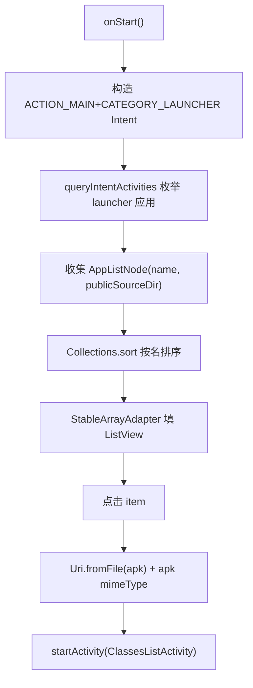

# 🧩 MainActivity

<Badge type="tip" text="Android 子系统" /> <Badge type="info" text="入口 Activity" />

> 入口 Activity：用 queryIntentActivities 枚举设备所有 launcher 应用填 ListView，点击后把 APK 路径传 ClassesListActivity。

📁 源码：<code>ClassySharkAndroid/app/src/main/java/com/google/classysharkandroid/activities/MainActivity.java</code> &nbsp; 📦 包：<code>com.google.classysharkandroid.activities</code>

## 职责

`MainActivity` 是 ClassySharkAndroid 应用的入口 `AppCompatActivity`。在 `onStart` 中构造 `ACTION_MAIN` + `CATEGORY_LAUNCHER` 的 Intent，经 `PackageManager.queryIntentActivities` 反射式枚举设备上所有带 launcher 图标的应用，把每个应用的 `publicSourceDir`（APK 路径）与进程名收集到 `AppListNode` 列表并按名排序，用 `StableArrayAdapter` 填充 `ListView`。点击某 app 后，将其 APK 文件作为 `Uri` + `apk` mimeType 传入 `ClassesListActivity`，同时附带应用名。内部类 `AppListNode implements Comparable` 按名排序。

## 关键方法 / 字段

| 名称 | 类型 | 说明 |
|------|------|------|
| `APP_NAME` | public static final String | Intent extra 键 `"APP_NAME"` |
| `lv` | private ListView | 应用列表控件 |
| `onCreate(Bundle)` | protected void | setContentView + 绑定 listView |
| `onStart()` | void | 枚举 launcher 应用填列表 + 设点击 |
| `onItemClick(...)` | void | 把 APK 路径作 Uri 传 ClassesListActivity |
| `convert(ArrayList)` | private static List&lt;String&gt; | AppListNode→名列表 |
| `AppListNode` | 内部类 | 持 name+file，implements Comparable |

## 工作流程

## 设计要点

- 🔍 **PackageManager 反射式枚举** — 用 launcher Intent 查询拿到所有已安装应用，是 Android 经典应用枚举模式。
- 📂 **APK 路径来源 publicSourceDir** — 直接取应用安装 APK 路径，作 Uri 传给下一步分析。
- 🔤 **按名排序** — `AppListNode implements Comparable`，列表按应用名字母序。
- 🧩 **稳定 ID 适配器** — 用 [[StableArrayAdapter]] 保证列表 ID 稳定。
- 🏷️ **APP_NAME extra** — 应用名经 Intent extra 传递，供下游 Activity 标题显示。

## 协作关系

- 依赖：[[StableArrayAdapter]]、[[ClassesListActivity]]
- 被调用：应用启动入口

## 已知问题 / TODO

- `pkgAppsList` 用原始 `List`（无泛型）且 `for (Object object : ...)` 逐元素强转 `ResolveInfo`，类型不安全。
- 点击 `ActivityNotFoundException` 被空 catch 吞，无用户反馈。
- `onStart` 每次回到前台都重新枚举所有应用，无缓存。

## 相关文档

- [Android 子系统架构](/reference/architecture/android)
- [快速开始](/guide/quick-start)
