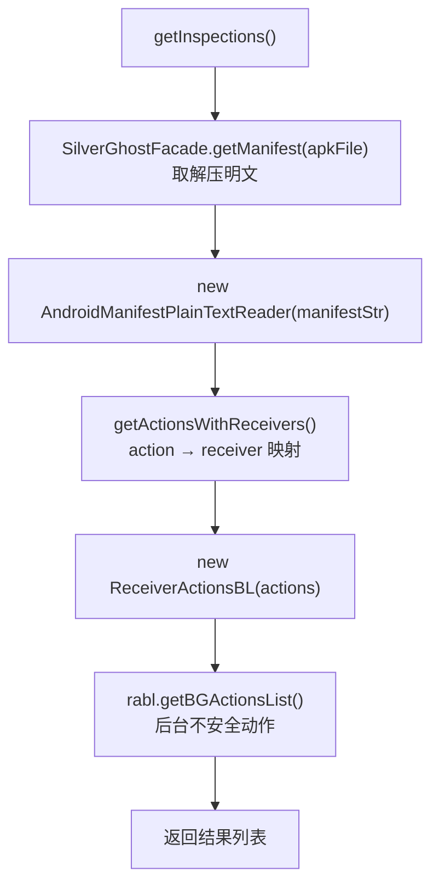

# 🧩 ManifestInspector

<Badge type="tip" text="APK Dashboard" /> <Badge type="info" text="编排器" />

> APK 清单检查编排器：取解压 manifest 文本，解析 action/receiver，过滤出后台不安全动作。

📁 源码：<code>ClassySharkWS/src/com/google/classyshark/silverghost/translator/apk/dashboard/manifest/ManifestInspector.java</code> &nbsp; 📦 包：<code>com.google.classyshark.silverghost.translator.apk.dashboard.manifest</code>

## 职责

`ManifestInspector` 是清单检查的编排器。它经 `SilverGhostFacade.getManifest(apkFile)` 取得解压后的 manifest 明文，喂给 `AndroidManifestPlainTextReader` 解析，取 action→receiver 映射，再经 `ReceiverActionsBL` 过滤，返回后台不安全动作列表。`getInspections()` 是唯一对外方法。当前仅检查后台接收器动作；`getServices()` 虽在 reader 中存在但此处未用，为未来服务检查预留。

## 关键方法 / 字段

| 名称 | 类型 | 说明 |
|------|------|------|
| `apkFile` | File | 待检查的 APK 文件 |
| `ManifestInspector(File)` | 构造器 | 保存 apkFile |
| `getInspections()` | List&lt;String&gt; | 取 manifest 文本 → 解析 → 过滤 → 后台动作列表 |

## 工作流程

## 设计要点

- 🚪 **facade 解耦二进制解压** — 不直接处理 Android 二进制 XML，而是经 `SilverGhostFacade.getManifest` 拿到明文，把 AXML→文本的转换隔离在 facade 之后。
- 🎯 **仅检查后台接收器动作** — `getInspections` 只走 `getActionsWithReceivers` + `ReceiverActionsBL`，聚焦 Android O+ 后台执行限制问题。
- 🔮 **预留服务检查** — `AndroidManifestPlainTextReader.getServices()` 存在但此处未调用，为未来服务维度检查留接口。
- 🧩 **编排而非实现** — 自身无 XML/业务逻辑，纯串联 facade → reader → BL 三层。

## 协作关系

- 依赖 [[AndroidManifestPlainTextReader]]
- 依赖 [[ReceiverActionsBL]]
- 依赖 [[SilverGhostFacade]]（取 manifest 文本）
- 被 [[ApkDashboard]] 的 `getManifestRecommendations()` 调用

## 已知问题 / TODO

- `getServices()` 未被使用，服务维度检查尚未实现。
- 若 facade 返回 null/空 manifest，下游 reader 构造时 `doc` 为 null，`getInspections` 静默返回空列表。

## 相关文档

- [APK Dashboard 架构](/reference/architecture/apk-dashboard)
- [Manifest 检查](/reference/architecture/apk-dashboard)
