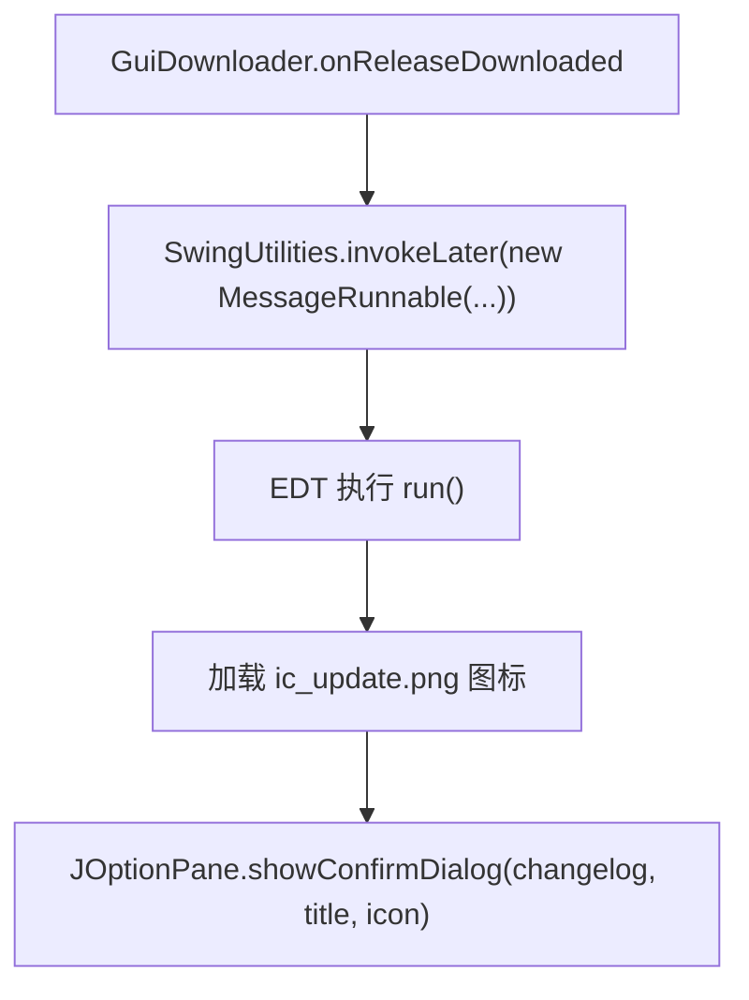

# 🧩 MessageRunnable

<Badge type="tip" text="更新子系统" /> <Badge type="info" text="Swing Runnable" />

> Runnable：构建标题/changelog 文案，在 EDT 上弹带图标 `JOptionPane` 更新提示——把 UI 弹窗逻辑从 GuiDownloader 分离可复用。

📁 源码：<code>ClassySharkWS/src/com/google/classyshark/updater/networking/MessageRunnable.java</code> &nbsp; 📦 包：<code>com.google.classyshark.updater.networking</code>

## 职责

`MessageRunnable` 实现 `Runnable`，封装"显示新版本更新提示弹窗"的全部 UI 逻辑。构造时接收版本标题与 changelog，经 `buildTitleFrom`/`buildChangelogFrom` 拼装展示文案；`run()` 加载 `/resources/ic_update.png` 图标，用 `JOptionPane.showConfirmDialog`（`DEFAULT_OPTION` + `INFORMATION_MESSAGE`）弹出提示。它是包级私有类，设计目的是把弹窗逻辑从 `GuiDownloader` 中分离，使其可独立复用与测试，并保证在 EDT 上执行。

## 关键方法 / 字段

| 名称 | 类型 | 说明 |
|------|------|------|
| `title` | private final String | 经 buildTitleFrom 构造的标题 |
| `changelog` | private final String | 经 buildChangelogFrom 构造的正文 |
| `ICON_PATH` | private final String | `/resources/ic_update.png` |
| `MessageRunnable(String, String)` | 构造器 | 包级私有，构造标题与正文 |
| `buildTitleFrom(String)` | private String | 拼 `"New ClassyShark version " + title` |
| `buildChangelogFrom(String)` | private String | 拼下载提示 + changelog |
| `run()` | void | 加载图标 + 弹 JOptionPane |

## 工作流程

## 设计要点

- 🧱 **UI 逻辑分离** — 弹窗文案与图标封装于此 Runnable，`GuiDownloader` 只调度，职责清晰可复用。
- 🧵 **EDT 安全** — 设计为 Runnable 由 `invokeLater` 投递到 EDT，保证 Swing 线程安全。
- 📝 **文案构造** — 标题/正文在构造时定型，`run` 只负责展示。
- 🔒 **包级私有** — 类无 `public`，仅 networking 包内 `GuiDownloader` 使用。

## 协作关系

- 依赖：无外部类（纯 Swing）
- 被调用：[[GuiDownloader]]（`onReleaseDownloaded` 中 invokeLater）

## 已知问题 / TODO

- 使用 `showConfirmDialog` 的 `DEFAULT_OPTION`，但未检查返回值，弹窗本质是"知道了"提示而非真确认。
- 图标路径硬编码，资源缺失时 `getResource` 返 null，`ImageIcon` 构造不抛但图标不显示。

## 相关文档

- [更新子系统架构](/reference/architecture/updater)
