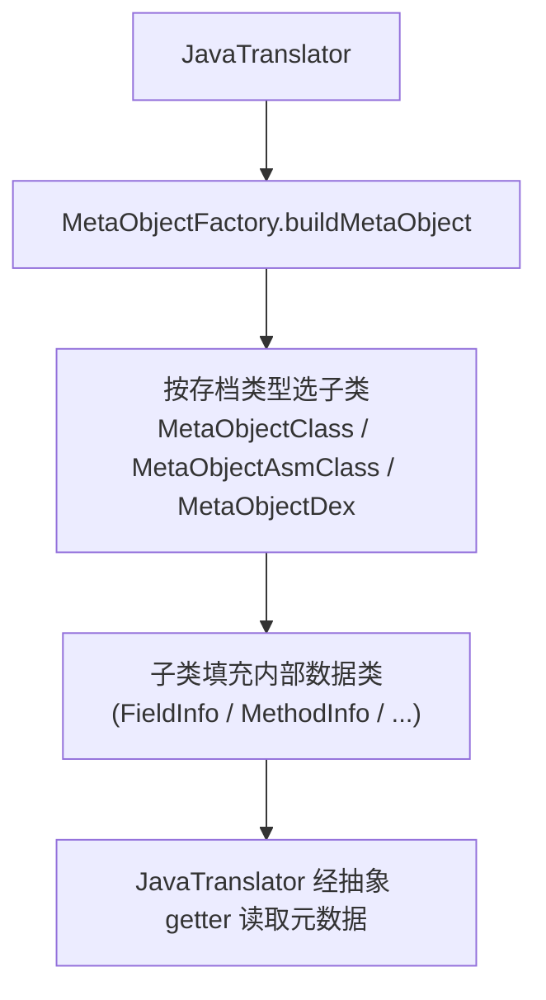

# 🧩 MetaObject

<Badge type="tip" text="Java Translator" /> <Badge type="info" text="抽象基类" />

> 类元数据的抽象基类，定义统一的元信息数据结构与 getter 契约，供反射/ASM/dexlib 三种来源适配。

📁 源码：<code>ClassySharkWS/src/com/google/classyshark/silverghost/translator/java/MetaObject.java</code> &nbsp; 📦 包：<code>com.google.classyshark.silverghost.translator.java</code>

## 职责

`MetaObject` 是 Java Translator 子系统的统一类型系统入口。它声明了一套内部数据类（接口、字段、构造器、方法、注解、参数、异常）和一组抽象 getter，把"一个类的元信息"抽象成稳定契约。三个子类（`MetaObjectClass` 反射、`MetaObjectAsmClass` ASM、`MetaObjectDex` dexlib）分别适配三种来源，但对外都呈现为 `MetaObject`，使 `JavaTranslator` 无需关心来源差异。它是纯数据持有者，不含业务逻辑。

## 关键方法 / 字段

| 名称 | 类型 | 说明 |
|------|------|------|
| `InterfaceInfo` | 内部类 | 接口元数据：`interfaceStr`、`genericsStr`（默认空） |
| `FieldInfo` | 内部类 | 字段元数据，`implements Comparable`（按 `name` 排序） |
| `ConstructorInfo` | 内部类 | 构造器元数据：注解、参数、修饰符 |
| `MethodInfo` | 内部类 | 方法元数据，`implements Comparable`（按 `name` 排序） |
| `AnnotationInfo` | 内部类 | 注解元数据：`annotationStr` |
| `ParameterInfo` | 内部类 | 参数元数据：`parameterStr`、`genericStr` |
| `ExceptionInfo` | 内部类 | 异常元数据：`exceptionStr` |
| `getName()` | abstract String | 类全限定名 |
| `getModifiers()` | abstract int | 修饰符（`java.lang.reflect.Modifier` 编码） |
| `getSuperclass()` / `getSuperclassGenerics()` | abstract String | 超类名与其泛型串 |
| `getInterfaces()` | abstract InterfaceInfo[] | 实现的接口列表 |
| `getDeclaredFields()` | abstract FieldInfo[] | 声明的字段 |
| `getDeclaredConstructors()` | abstract ConstructorInfo[] | 声明的构造器 |
| `getDeclaredMethods()` | abstract MethodInfo[] | 声明的方法 |
| `getClassGenerics(String)` | abstract String | 类自身的泛型参数串 |

## 工作流程

## 设计要点

- **统一类型系统** — 所有元信息以 `MetaObject.XxxInfo` 数据类表达，子类只负责把来源特定的表示转译成这些数据类，`JavaTranslator` 完全面向抽象编程。
- **Comparable 启用排序** — `FieldInfo` 与 `MethodInfo` 实现 `Comparable`，`compareTo` 按 `name` 字段比较，让 `JavaTranslator` 可直接 `Collections.sort` 出字母序存根。
- **泛型字段默认空串** — `genericsStr`/`genericReturnType` 默认 `""`，只有反射子类会填充，ASM/dex 变体保留空串，呈现层无需判空。
- **纯数据持有者** — 抽象类本身无状态、无逻辑，仅定义契约与数据结构，符合 Template Method 的数据载体变体。

## 协作关系

- 被 [[JavaTranslator]] 依赖（核心元数据来源）
- 被 [[MetaObjectWithMapper]] 装饰（继承并包装）
- 子类 → [[MetaObjectClass]]、[[MetaObjectAsmClass]]、[[MetaObjectDex]]
- 被 [[MetaObjectFactory]] 实例化

## 已知问题 / TODO

- 无明显已知问题；作为抽象数据契约职责清晰。

## 相关文档

- [Java Translator 子系统](/reference/architecture/java-translator)
- [元对象工厂](/reference/modules/MetaObjectFactory)
