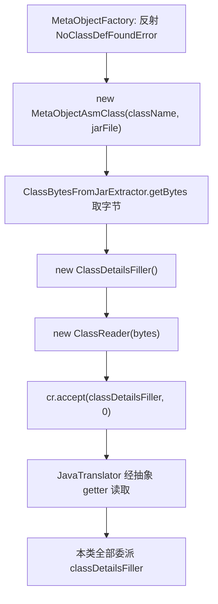

# 🧩 MetaObjectAsmClass

<Badge type="tip" text="Java Translator" /> <Badge type="info" text="适配器模式" />

> 基于 ASM 字节码解析的 MetaObject 实现，反射加载失败时启用，不依赖 classpath。

📁 源码：<code>ClassySharkWS/src/com/google/classyshark/silverghost/translator/java/clazz/asm/MetaObjectAsmClass.java</code> &nbsp; 📦 包：<code>com.google.classyshark.silverghost.translator.java.clazz.asm</code>

## 职责

`MetaObjectAsmClass` 是 `MetaObject` 的 ASM 实现。当目标类无法在运行时 classpath 中反射加载（依赖缺失、`NoClassDefFoundError`）时，`MetaObjectFactory` 退回本类。它有三个构造重载，分别从 jar 条目、独立 `.class` 文件、`Class` 对象资源流取得类字节，再交给 `ClassDetailsFiller`（ASM `ClassVisitor`）解析。它是纯适配器——所有 getter 全部委派给持有的 `ClassDetailsFiller`。

## 关键方法 / 字段

| 名称 | 类型 | 说明 |
|------|------|------|
| `classDetailsFiller` | ClassDetailsFiller | 真正持有解析结果的对象，所有 getter 委派给它 |
| `MetaObjectAsmClass(String className, File archiveFile)` | 构造器 | jar 场景：`ClassBytesFromJarExtractor.getBytes` 取字节 |
| `MetaObjectAsmClass(File archiveFile)` | 构造器 | 独立 .class 场景：`Files.readAllBytes` 读字节 |
| `MetaObjectAsmClass(Class clazz)` | 构造器 | 已有 Class 场景：类加载器资源流读字节 |
| `getName()` | String | 委派 `classDetailsFiller.getName()` |
| `getModifiers()` | int | 委派 `classDetailsFiller.getModifiers()` |
| `getSuperclass()` / `getSuperclassGenerics()` | String | 委派；泛型固定空串 |
| `getClassGenerics(String)` | String | 委派，固定返回空串 |
| `getInterfaces()` | InterfaceInfo[] | 委派 `classDetailsFiller.getInterfaces()` |
| `getDeclaredFields()` / `getDeclaredConstructors()` / `getDeclaredMethods()` | ...Info[] | 委派对应数组 getter |
| `getAnnotations()` | AnnotationInfo[] | 委派 `classDetailsFiller.getAnnotationInfo()` |

## 工作流程

## 设计要点

- **三构造重载统一字节来源** — jar（`ClassBytesFromJarExtractor`）、独立文件（`Files.readAllBytes`）、Class 资源（`getResourceAsStream`），三条路径都把字节喂给同一个 `ClassReader`+`ClassDetailsFiller`，差异仅在读字节方式。
- **纯适配器** — 本类无自有状态（除 `classDetailsFiller` 字段），所有 getter 透传，符合适配器模式；真正逻辑在 `ClassDetailsFiller`。
- **反射回退出口** — `MetaObjectFactory.getMetaObjectFromJar` 在 `NoClassDefFoundError`（含二次校验）时创建本类，保证依赖不在 classpath 仍可解析。
- **无泛型、无注解、无异常** — 因委派 `ClassDetailsFiller`，继承其限制：泛型全空、注解空、方法异常空。

## 协作关系

- 继承 → [[MetaObject]]
- 持有并委派 → [[ClassDetailsFiller]]
- 用 [[ClassBytesFromJarExtractor]] 取 jar 内字节
- 被 [[MetaObjectFactory]] 在 ASM 回退路径创建

## 已知问题 / TODO

- 三个构造器均 `catch (Exception e) { e.printStackTrace(); }` 静默吞异常，失败时 `classDetailsFiller` 为 null，下游 getter 会 NPE 而非友好报错。
- `getSuperclass` 委派 `getSuperClass`（注意方法名大小写差异），靠 `ClassDetailsFiller` 暴露的 `getSuperClass()`。
- `main`/`testCustomClass` 硬编码桌面测试路径，属测试残留。

## 相关文档

- [Java Translator 子系统](/reference/architecture/java-translator)
- [元对象工厂](/reference/modules/MetaObjectFactory)
