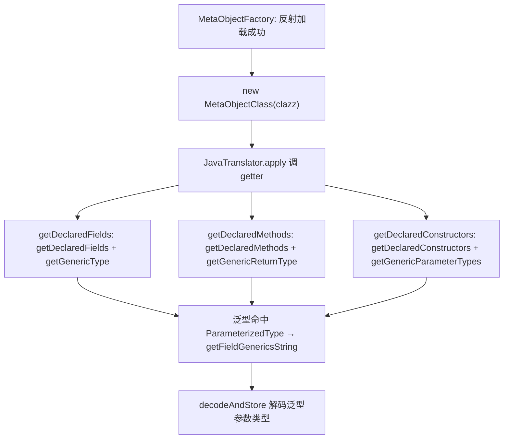

# 🧩 MetaObjectClass

<Badge type="tip" text="Java Translator" /> <Badge type="info" text="反射适配器" />

> 基于反射的 MetaObject 实现，运行时可加载时优先用，是唯一发出泛型信息的实现。

📁 源码：<code>ClassySharkWS/src/com/google/classyshark/silverghost/translator/java/clazz/reflect/MetaObjectClass.java</code> &nbsp; 📦 包：<code>com.google.classyshark.silverghost.translator.java.clazz.reflect</code>

## 职责

`MetaObjectClass` 是 `MetaObject` 的反射实现，包装一个 `Class<?>`。当 `MetaObjectFactory` 成功用 `ClassUtils` 从 jar 反射加载到类时，默认选用本类。它经 `java.lang.reflect` 的 `getDeclaredFields`/`getDeclaredConstructors`/`getDeclaredMethods`/`getAnnotations`/`getTypeParameters`/`getGenericParameterTypes`/`getGenericReturnType` 提取元数据，并填充到 `MetaObject` 的数据类中。它是三个 `MetaObject` 实现中唯一发出泛型信息的——ASM 与 dex 变体的泛型字段恒为空串。

## 关键方法 / 字段

| 名称 | 类型 | 说明 |
|------|------|------|
| `clazz` | Class | 被包装的反射类对象 |
| `getName()` | String | `clazz.getName()` |
| `getModifiers()` | int | `clazz.getModifiers()` |
| `getSuperclass()` | String | 超类全限定名（无超类返 null） |
| `getClassGenerics(String)` | String | 类泛型，如 `<T, U>`（`TypeVariable` 拼接） |
| `getSuperclassGenerics()` | String | 超类泛型参数串 |
| `getInterfaces()` | InterfaceInfo[] | 接口列表，含各接口泛型 |
| `getDeclaredFields()` | FieldInfo[] | 字段，泛型经 `getGenericType` + `ParameterizedType` 解析 |
| `getDeclaredConstructors()` | ConstructorInfo[] | 构造器，参数用原始 `Class[]` + 泛型 `Type[]` 双路 |
| `getDeclaredMethods()` | MethodInfo[] | 方法，含异常类型与泛型返回 |
| `getClassGenericsString(TypeVariable[])` | private String | 拼类/超类/接口的 `<T, U>` |
| `getFieldGenericsString(Type[])` | private String | 拼字段/参数/返回的 `<String, Integer>`，经 `QualifiedTypesMap.decodeAndStore` 解码 |
| `convertParameters(Class[], Type[])` | private ParameterInfo[] | 原始类型与泛型双路发参数 |
| `convertAnnotations(Annotation[])` / `convertExceptions(Class[])` | private ...Info[] | 注解/异常转换 |

## 工作流程

## 设计要点

- **唯一泛型来源** — 通过 `getTypeParameters`/`getGenericParameterTypes`/`getGenericReturnType`/`getGenericType` 读取 `ParameterizedType`，发出 `<T, U>` 与 `<String, Integer>`；ASM/dex 实现对应字段恒空，呈现层统一按「空则省略」处理。
- **原始与泛型双路** — `convertParameters` 同时接收原始 `Class[]`（作 `parameterStr`，保证 import 登记用全限定名）与泛型 `Type[]`（作 `genericStr`），两者分开发出。
- **泛型参数解码复用** — `getFieldGenericsString` 调静态 `QualifiedTypesMap.decodeAndStore(type, null)` 解码泛型参数的类型串（传 null 不登记），与类型登记簿共用解码逻辑。
- **注解用简单名** — `convertAnnotations` 取 `annotationType().getSimpleName()`，存根中注解只显示短名（如 `@Override`）。

## 协作关系

- 继承 → [[MetaObject]]
- 被 [[MetaObjectFactory]] 在反射成功时创建
- 被 [[JavaTranslator]] 的测试构造器 `JavaTranslator(Class)` 直接创建
- 依赖 → [[QualifiedTypesMap]]（`decodeAndStore` 解码泛型参数）
- 依赖 → [[ClassUtils]]（上游反射加载）

## 已知问题 / TODO

- `getFieldGenericsString` 含 `// TODO not sure in java generics spec` 与 `// TODO are generic params evaluated with class params` 两处注释，对泛型参数与类参数的求值规则存疑。
- `convertParameters` 用裸 `Class` 原始类型，编译期有 unchecked 警告。
- `main` 硬编码 `Reducer.class` 测试。

## 相关文档

- [Java Translator 子系统](/reference/architecture/java-translator)
- [元对象工厂](/reference/modules/MetaObjectFactory)
