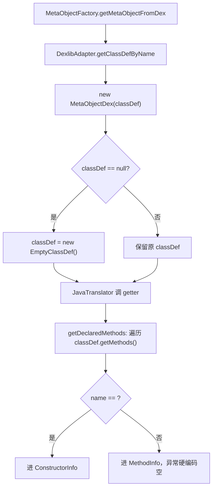

# 🧩 MetaObjectDex

<Badge type="tip" text="Java Translator" /> <Badge type="info" text="适配器模式 / 空对象" />

> 由 dexlib2 ClassDef 支撑的 MetaObject 实现，类从 APK/DEX 加载时使用。

📁 源码：<code>ClassySharkWS/src/com/google/classyshark/silverghost/translator/java/dex/MetaObjectDex.java</code> &nbsp; 📦 包：<code>com.google.classyshark.silverghost.translator.java.dex</code>

## 职责

`MetaObjectDex` 是 `MetaObject` 的 dex 实现，包装一个 dexlib2 `ClassDef`。当类来自 APK/DEX 时，`MetaObjectFactory` 经 `DexlibAdapter.getClassDefByName` 取到 `ClassDef` 后创建本类。它把 `ClassDef` 的字段、方法、接口、注解适配到 `MetaObject` 的数据类，方法名 `<init>` 检测构造函数。若 `ClassDef` 为空，回退到内部 `EmptyClassDef` 空对象以避免下游 NPE。无泛型支持，方法无异常（硬编码空）。

## 关键方法 / 字段

| 名称 | 类型 | 说明 |
|------|------|------|
| `classDef` | ClassDef | 被包装的 dexlib 类定义 |
| `getName()` | String | `DexlibAdapter.getClassStringFromDex(classDef.getType())` |
| `getModifiers()` | int | `classDef.getAccessFlags()` |
| `getSuperclass()` | String | 超类经 `getClassStringFromDex` 规范化 |
| `getInterfaces()` | InterfaceInfo[] | 接口列表，逐个规范化 |
| `getDeclaredFields()` | FieldInfo[] | 字段，类型经 `DexlibAdapter.getTypeName` |
| `getDeclaredConstructors()` | ConstructorInfo[] | 方法中 `isConstructor`（`<init>`）为真者 |
| `getDeclaredMethods()` | MethodInfo[] | 方法中非构造器者，异常硬编码空数组 |
| `getAnnotations()` | AnnotationInfo[] | 类注解，类型经 `getTypeName` |
| `convertAnnotations(Set)` | private AnnotationInfo[] | dexlib 注解集转数组 |
| `convertParameters(List)` | private ParameterInfo[] | dexlib `MethodParameter` 列表转数组 |
| `isConstructor(Method)` | private static boolean | `method.getName().equals("<init>")` |
| `EmptyClassDef` | private static class | ~200 行空对象，实现 `ClassDef` 全部方法返回空 |
| `getClassGenerics` / `getSuperclassGenerics` | String | 固定返回 `""` |

## 工作流程

## 设计要点

- **构造器靠 `<init>` 检测** — `isConstructor` 判定方法名为 `<init>`，与 `ClassDetailsFiller` 的 ASM 侧判定一致，跨字节码格式统一约定。
- **空对象防 NPE** — `ClassDef` 为 null 时换装 `EmptyClassDef`，该内部类约 200 行实现 `ClassDef` 全部接口方法返回空集合/空串/0，避免下游遍历字段/方法时 NPE。
- **无泛型、无异常** — `getClassGenerics`/`getSuperclassGenerics` 固定空串，`mi.exceptionTypes` 硬编码空数组，dex 存根不显示泛型与 `throws`。
- **类型解码统一委派** — 所有类型串经 `DexlibAdapter.getTypeName`/`getClassStringFromDex`，与 ASM 侧共用适配器。

## 协作关系

- 继承 → [[MetaObject]]
- 被 [[MetaObjectFactory]] 在 dex/apk 路径创建
- 依赖 → [[DexlibAdapter]]（类型/超类/接口/注解解码）
- 上游 `ClassDef` 来自 `DexlibAdapter.getClassDefByName` + [[DexlibLoader]]

## 已知问题 / TODO

- 方法异常类型硬编码空数组（`new ExceptionInfo[0]`），dex 存根不显示 `throws` 子句。
- 无泛型支持，泛型字段全返空串。
- `main` 硬编码桌面 `classes.dex` 测试路径。
- `EmptyClassDef` 约 200 行样板代码仅为满足接口空实现，可考虑抽象基类或默认实现简化。

## 相关文档

- [Java Translator 子系统](/reference/architecture/java-translator)
- [元对象工厂](/reference/modules/MetaObjectFactory)
- [dexlib 适配器](/reference/modules/DexlibAdapter)
