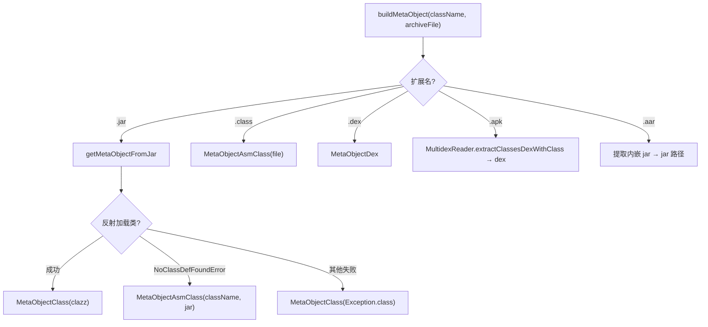

# 🧩 MetaObjectFactory

<Badge type="tip" text="Java Translator" /> <Badge type="info" text="静态工厂模式" />

> 按存档扩展名选择 MetaObject 子类的静态工厂，含反射到 ASM 的回退策略。

📁 源码：<code>ClassySharkWS/src/com/google/classyshark/silverghost/translator/java/MetaObjectFactory.java</code> &nbsp; 📦 包：<code>com.google.classyshark.silverghost.translator.java</code>

## 职责

`MetaObjectFactory` 是 Java Translator 子系统的入口分发器。`buildMetaObject(className, archiveFile)` 依据存档文件扩展名（`.jar`/`.class`/`.dex`/`.apk`/`.aar`）路由到对应的构造路径，选出合适的 `MetaObject` 子类实例。对于 jar，它优先尝试反射加载（泛型信息更全），失败时回退到 ASM 解析（始终可用）；对 apk/aar，它先从 zip 中提取出含目标类的 dex 再委托 dex 路径。所有失败兜底为 `new MetaObjectClass(Exception.class)`。

## 关键方法 / 字段

| 名称 | 类型 | 说明 |
|------|------|------|
| `buildMetaObject(String, File)` | static MetaObject | 入口，按扩展名分发 |
| `getMetaObjectFromJar(String, File)` | private static MetaObject | jar：先反射，`NoClassDefFoundError` 回退 ASM |
| `getMetaObjectFromClass(File)` | private static MetaObject | .class：直接 `MetaObjectAsmClass` |
| `getMetaObjectFromDex(String, File)` | private static MetaObject | .dex：`DexlibAdapter.getClassDefByName` + `MetaObjectDex` |
| `getMetaObjectFromApk(String, File)` | private static MetaObject | .apk：`MultidexReader.extractClassesDexWithClass` 再走 dex |
| `getMetaObjectFromAar(String, File)` | private static MetaObject | .aar：提取内嵌 jar 到临时文件，递归 jar 路径 |
| `verifyLoadedClassAndBuildASMFallback(...)` | private static MetaObject | 校验反射类可访问，二次 `NoClassDefFoundError` 回退 ASM |

## 工作流程

## 设计要点

- **反射优先 + ASM 兜底** — 反射路径泛型信息更完整（`MetaObjectClass` 发 `<T,U>`、`<String,Integer>`），但需目标类在 classpath 可加载；ASM 路径（`MetaObjectAsmClass`）不依赖 classpath，始终可用，回退由 `NoClassDefFoundError` 触发。
- **二次校验** — `verifyLoadedClassAndBuildASMFallback` 在反射加载后还会调用 `getFields`/`getMethods` 等，捕获运行期 `NoClassDefFoundError`（依赖类缺失）再次回退 ASM。
- **apk/aar 解包再委托** — apk 经 `MultidexReader` 找到含目标类的 dex 文件再走 dex 分支；aar 先把内嵌 `classes.jar` 落到临时文件再走 jar 分支，复用现有路径。
- **统一兜底** — 任何异常路径都落到 `new MetaObjectClass(Exception.class)`，保证下游永不拿到 null。
- **私有构造 + 纯静态** — 工具类风格，`private MetaObjectFactory()` 防实例化。

## 协作关系

- 被 [[JavaTranslator]] 调用（构造元对象）
- 创建 → [[MetaObjectClass]]、[[MetaObjectAsmClass]]、[[MetaObjectDex]]
- 依赖 → [[ClassUtils]]（jar 反射加载）
- 依赖 → [[DexlibAdapter]]（dex 类查找）
- 依赖 → [[MultidexReader]]（apk/aar dex 提取）
- 依赖 → [[DexlibLoader]]（dex 文件加载）

## 已知问题 / TODO

- `getMetaObjectFromAar` 中异常被静默吞掉（空 `catch`），失败时直接回退 `Exception.class` 而非回退 ASM，与 jar 路径的回退策略不一致。
- `verifyLoadedClassAndBuildASMFallback` 中多个 `if` 分别赋值同一个 `result`，逻辑冗余（任一为真即够），可简化为单次判断。
- 临时文件 `File.createTempFile("classes", "jar")` 标记 `deleteOnExit`，但运行期不清理。

## 相关文档

- [Java Translator 子系统](/reference/architecture/java-translator)
- [Java 翻译器](/reference/modules/JavaTranslator)
