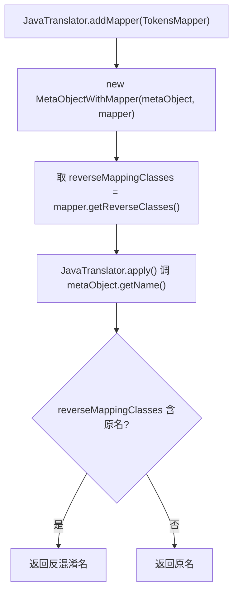

# 🧩 MetaObjectWithMapper

<Badge type="tip" text="Java Translator" /> <Badge type="info" text="装饰器模式" />

> 用 TokensMapper 反向类映射替换 getName() 结果的装饰器 MetaObject，是 ProGuard 反混淆进入呈现管道的切入点。

📁 源码：<code>ClassySharkWS/src/com/google/classyshark/silverghost/translator/java/MetaObjectWithMapper.java</code> &nbsp; 📦 包：<code>com.google.classyshark.silverghost.translator.java</code>

## 职责

`MetaObjectWithMapper` 继承 `MetaObject`，包装另一个 `MetaObject` 实例。它只覆盖 `getName()`——用 `TokensMapper.getReverseClasses()` 提供的"混淆名→原始名"反向映射表，把被包装对象的类名替换回反混淆后的名字；其余所有 getter 直接透传给被包装对象。`JavaTranslator` 通过 `addMapper` 在元对象外再套这一层，使类声明和 import 的键使用反混淆名。

## 关键方法 / 字段

| 名称 | 类型 | 说明 |
|------|------|------|
| `reverseMappingClasses` | Map&lt;String,String&gt; | 反向类映射表，来自 `TokensMapper.getReverseClasses()` |
| `metaObject` | MetaObject | 被包装的元对象 |
| `MetaObjectWithMapper(MetaObject, TokensMapper)` | 构造器 | 装配被包装对象并取反向映射表 |
| `getName()` | String | **唯一覆盖**：查反向表替换类名，未命中则原样返回 |
| `getClassGenerics(String)` | String | 透传给 `metaObject` |
| `getAnnotations()` | AnnotationInfo[] | 透传 |
| `getModifiers()` | int | 透传 |
| `getSuperclass()` / `getSuperclassGenerics()` | String | 透传 |
| `getInterfaces()` | InterfaceInfo[] | 透传 |
| `getDeclaredFields()` | FieldInfo[] | 透传 |
| `getDeclaredConstructors()` | ConstructorInfo[] | 透传 |
| `getDeclaredMethods()` | MethodInfo[] | 透传 |

## 工作流程

## 设计要点

- **最小覆盖面** — 仅重写 `getName` 一个方法，其余全透传，符合装饰器模式的"单一职责增强"原则；只有类名（影响类声明头与 import 键）被反混淆，字段/方法/参数类型仍按原样呈现。
- **防御性可空** — `getName` 中若 `reverseMappingClasses == null` 临时建空 `TreeMap`，避免 NPE；但源码注释 `// TODO not clear why is it null` 承认这个 null 场景的根因未明，可能是潜在 bug。
- **呈现层切入点** — 反混淆只发生在输出端（getName），不修改底层元对象，保证映射可逆、可重复套用。

## 协作关系

- 继承 → [[MetaObject]]
- 包装任意 [[MetaObject]] 子类（[[MetaObjectClass]]/[[MetaObjectAsmClass]]/[[MetaObjectDex]]）
- 被 [[JavaTranslator]] 通过 `addMapper` 装配
- 依赖 → [[TokensMapper]]（反向映射来源）

## 已知问题 / TODO

- `// TODO not clear why is it null` — 源码承认 `reverseMappingClasses` 可能为 null 的原因不明，当前用空 TreeMap 兜底，但根因未排查，存在潜在缺陷。
- 仅反混淆类名，字段类型、方法返回类型、超类、接口等仍用混淆名，反混淆覆盖不完整。

## 相关文档

- [Java Translator 子系统](/reference/architecture/java-translator)
- [Java 翻译器](/reference/modules/JavaTranslator)
