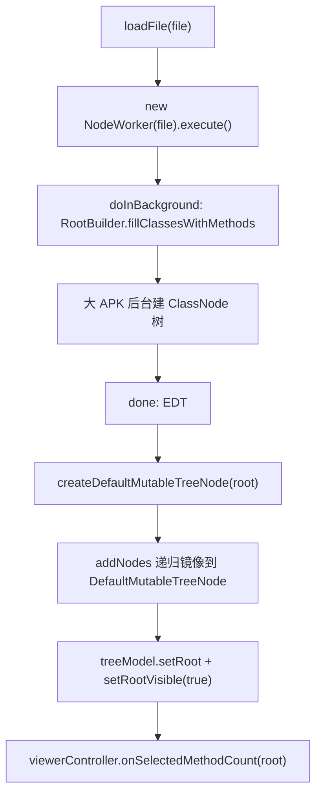

# 🧩 MethodsCountPanel

<Badge type="tip" text="GUI 计数层" /> <Badge type="info" text="宿主面板" />

> 左侧选项卡托管方法计数 JTree，后台跑 RootBuilder 建 ClassNode 树。

📁 源码：<code>ClassySharkWS/src/com/google/classyshark/gui/panel/methodscount/MethodsCountPanel.java</code> &nbsp; 📦 包：<code>com.google.classyshark.gui.panel.methodscount</code>

## 职责

`MethodsCountPanel` 是左侧「Methods count」选项卡的宿主 `JPanel`，内含一棵方法计数 `JTree`。`loadFile(File)` 派发 `NodeWorker`（`SwingWorker`）在后台跑 `RootBuilder.fillClassesWithMethods` 按包递归建 `ClassNode` 树，完成后在 EDT 把树镜像到 `DefaultTreeModel` 并把根推给环形图。它与主类树共享 `CellRenderer` 与 `FileTransferHandler`。

## 关键方法 / 字段

| 名称 | 类型 | 说明 |
|------|------|------|
| `viewerController` | ViewerController | 注入的窄回调 |
| `treeModel` | DefaultTreeModel | 树模型 |
| `jTree` | JTree | 方法计数树 |
| `loadFile(File)` | void | 派发 NodeWorker |
| `setup()` | private void | 组装树、设渲染器/监听/拖放 |
| `addNodes(ClassNode, DefaultMutableTreeNode)` | private void | 递归镜像 ClassNode→JTree 节点 |
| `createDefaultMutableTreeNode(ClassNode)` | private | 建根并递归 |
| `NodeWorker` | 内部类 | SwingWorker 后台跑 RootBuilder |

## 工作流程

## 设计要点

- ⚙️ **SwingWorker 隔离** — `RootBuilder` 对大 APK 较慢，放 `doInBackground`，`done` 回 EDT 换模型，不阻塞 UI。
- 🪞 **递归镜像** — `addNodes` 把 `ClassNode` 树逐层镜像到 Swing `DefaultMutableTreeNode`，保留层级。
- 🎨 **共享渲染器** — 用 `CellRenderer`，与主类树主题一致。
- 🖱️ **选择即推送** — 树选择监听立即把选中 `ClassNode` 推给 `ViewerController`，驱动环形图。
- 📥 **拖放目标** — 注册 `FileTransferHandler`，方法计数区也可拖入存档。

## 协作关系

- 依赖 → [[ViewerController]]、[[CellRenderer]]、[[FileTransferHandler]]、[[GuiMode]]
- 依赖 → `RootBuilder`、`ClassNode`
- 被使用 ← [[ClassySharkPanel]]

## 已知问题 / TODO

- 🐛 `NodeWorker.done` 的 `catch (Exception ex)` 为空块，吞掉所有异常无日志，加载失败静默无反馈。
- 🐛 选择监听强转 `(ClassNode) defaultMutableTreeNode.getUserObject()`，根节点未初始化前选择会 NPE/ClassCastException。

## 相关文档

- [GUI 架构](/reference/architecture/gui-layer)
- [[CellRenderer]]
