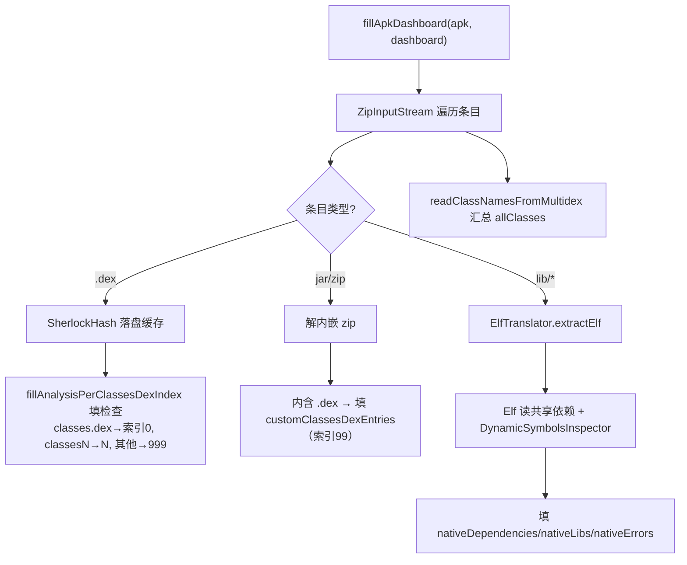

# 🧩 MultidexReader

<Badge type="tip" text="Java Translator" /> <Badge type="info" text="APK 扫描枢纽" />

> 扫描 APK zip 按需提取 classes*.dex（含嵌入 jar/zip 内 dex），是 APK 分析的中心枢纽。

📁 源码：<code>ClassySharkWS/src/com/google/classyshark/silverghost/translator/java/dex/MultidexReader.java</code> &nbsp; 📦 包：<code>com.google.classyshark.silverghost.translator.java.dex</code>

## 职责

`MultidexReader` 是 APK（与多 dex）扫描的中心枢纽。`fillApkDashboard` 遍历 APK zip 条目：对每个 `.dex` 经 `fillAnalysisPerClassesDexIndex` 提取检查并填入 dashboard，对 `lib/` 下原生库用 `ElfTranslator`+`DynamicSymbolsInspector` 扫描依赖与符号，对内嵌 `jar`/`zip` 再解一层找其中的 dex。`readClassNamesFromMultidex` 把所有 dex 的类名汇入 `allClasses`。`extractClassesDexWithClass` 线性搜索含指定类的 dex 文件，供 `MetaObjectFactory` 按类定位 dex。提取经 `SherlockHash` 缓存避免重复落盘。

## 关键方法 / 字段

| 名称 | 类型 | 说明 |
|------|------|------|
| `fillApkDashboard(File, ApkDashboard)` | static void | 主扫描：dex 检查 + 原生库符号 + 类名汇总 |
| `readClassNamesFromMultidex(File, List, List)` | static void | 汇总所有 dex（含嵌入）的类名到列表 |
| `extractClassesDexWithClass(String, File)` | static File | 线性搜含目标类的 dex 文件（含内部 zip 内 dex） |
| `extractClassesDex(String, File, DexInfoTranslator)` | static File | 按 dex 名提取并设置索引（含哨兵 99/999） |
| `MultidexReader()` | private | 构造私有，纯静态工具 |

## 工作流程

## 设计要点

- **三路条目分发** — `.dex` 走 dex 分析、`jar`/`zip` 走内嵌解包、`lib/` 走 ELF 原生分析，单次 zip 遍历覆盖 APK 全部成分。
- **嵌入 dex 双层命名** — 内嵌 jar/zip 内的 dex 用 `外层条目名 + "###" + 内层条目名` 连接，保留来源链路便于追溯。
- **哨兵索引区分来源** — 正规 `classes.dex`/`classesN.dex` 用数字索引（0、N），自定义/嵌入 dex 用 99（内嵌）或 999（非 classes 命名的 dex），下游据此分类展示。
- **SherlockHash 缓存落盘** — 所有 dex/内嵌 zip 提取经 `SherlockHash.INSTANCE.getFileFromZipStream`，按内容哈希缓存到本地文件，避免重复解压。
- **按类定位 dex** — `extractClassesDexWithClass` 逐个 dex 读类名列表判断包含关系，找到即返回该 dex 文件，供 `MetaObjectFactory` 精确加载。

## 协作关系

- 被 [[MetaObjectFactory]] 的 `getMetaObjectFromApk` 调用（`extractClassesDexWithClass`）
- 调用 `ApkDashboard.fillAnalysisPerClassesDexIndex`
- 依赖 → [[SherlockHash]]（落盘缓存）
- 依赖 → `DexReader`（读 dex 类名）
- 依赖 → `ElfTranslator`、`DynamicSymbolsInspector`（原生库分析）

## 已知问题 / TODO

- `extractClassesDexWithClass` 含 `// TODO need to delete this file`，提取的临时 dex 文件未清理。
- 内嵌 zip 内的 dex 仅支持一层（注释 `currently only one is supported` / `Dynamic dex loading, currently one one inner zip is supported`），多层嵌套无法处理。
- `readClassNamesFromMultidex` 中内嵌 zip 的 `inner_zip` 文件名固定，多个内嵌 zip 会互相覆盖缓存。
- 多处 `catch (Exception e) { e.printStackTrace(); }` 静默吞异常。

## 相关文档

- [Java Translator 子系统](/reference/architecture/java-translator)
- [元对象工厂](/reference/modules/MetaObjectFactory)
- [dex 元对象](/reference/modules/MetaObjectDex)
