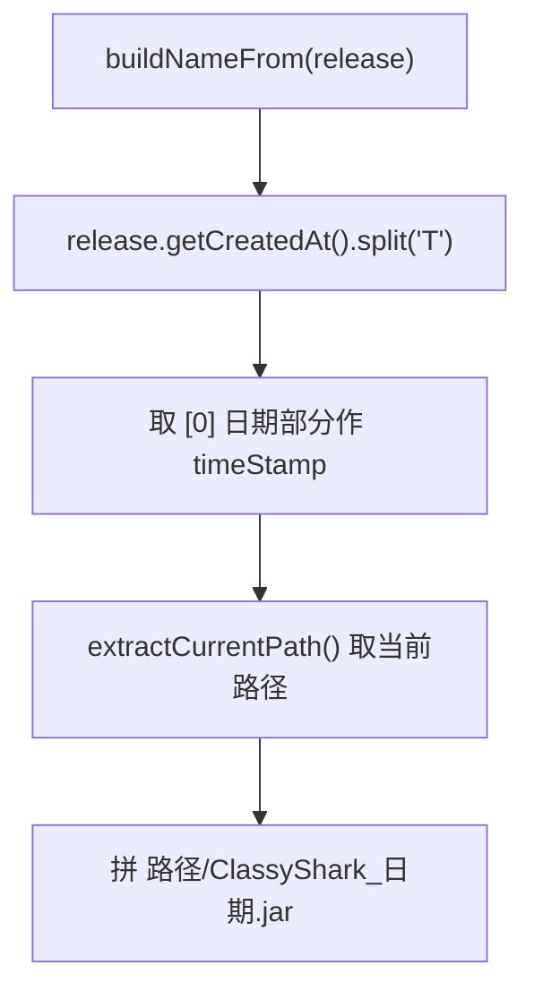

# 🧩 NamingUtils

<Badge type="tip" text="更新子系统" /> <Badge type="info" text="命名工具" />

> 为新 release 生成文件名 `ClassyShark_<createdAt-date>.jar` 放当前工作目录，用 createdAt 时间戳区分版本。

📁 源码：<code>ClassySharkWS/src/com/google/classyshark/updater/utils/NamingUtils.java</code> &nbsp; 📦 包：<code>com.google.classyshark.updater.utils</code>

## 职责

`NamingUtils` 为下载的新版本生成文件名并解析当前工作目录。`buildNameFrom(Release)` 取 release 的 `createdAt`，按 `T` 分割取日期部分作时间戳，拼成 `<当前路径>/ClassyShark_<日期>.jar`。`extractCurrentPath()` 返回 `Paths.get(".").toAbsolutePath().normalize()` 的规范化绝对当前路径。用 createdAt 时间戳区分不同版本文件，保留旧版本不覆盖。

## 关键方法 / 字段

| 名称 | 类型 | 说明 |
|------|------|------|
| `PREFIX` | private static final String | `ClassyShark` |
| `SUFFIX` | private static final String | `.jar` |
| `FILENAME` | final String | `ClassyShark.jar`（实例字段，疑似未用） |
| `buildNameFrom(Release)` | static String | 拼 `当前路径/ClassyShark_<日期>.jar` |
| `extractCurrentPath()` | static String | 规范化绝对当前路径 |

## 工作流程

## 设计要点

- 🕒 **createdAt 时间戳区分版本** — 用 release 创建日期作文件名一部分，保留多版本不覆盖。
- 📂 **放当前工作目录** — `Paths.get(".").toAbsolutePath().normalize()`，下载到启动时的工作目录。
- 🧱 **前缀/后缀常量** — `ClassyShark` + `.jar`，便于整体改名。
- 🛡️ **normalize 规范化** — 去除路径中的 `.`/`..` 冗余段。

## 协作关系

- 依赖：[[Release]]（getCreatedAt）
- 被调用：[[FileUtils]]（buildNameFrom 确定下载路径、extractCurrentPath）

## 已知问题 / TODO

- `FILENAME` 是非静态实例字段，与同类静态方法风格不一致，且似乎未被使用。
- `buildNameFrom` 对 `createdAt` 为空或格式异常的情况仅简单取分割第一段，可能生成 `ClassyShark_.jar`。

## 相关文档

- [更新子系统架构](/reference/architecture/updater)
