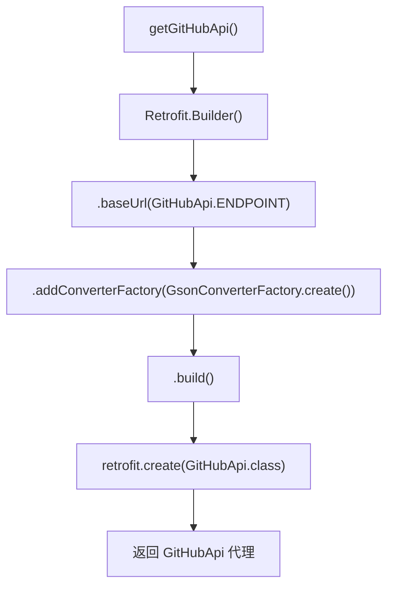

# 🧩 NetworkManager

<Badge type="tip" text="更新子系统" /> <Badge type="info" text="Retrofit 工厂" />

> Retrofit 工厂：用 Gson 转换器构建 `GitHubApi` 实例，单一职责工厂方法。

📁 源码：<code>ClassySharkWS/src/com/google/classyshark/updater/networking/NetworkManager.java</code> &nbsp; 📦 包：<code>com.google.classyshark.updater.networking</code>

## 职责

`NetworkManager` 是更新子系统的网络层工厂，提供静态方法 `getGitHubApi()`：以 `GitHubApi.ENDPOINT` 为 baseUrl、`GsonConverterFactory` 为转换器构建一个 `Retrofit` 实例，并通过 `retrofit.create(GitHubApi.class)` 生成 API 代理对象返回。它遵循单一职责——只负责"创建配置好的 GitHubApi 实例"，不参与请求发起或响应处理。

## 关键方法 / 字段

| 名称 | 类型 | 说明 |
|------|------|------|
| `getGitHubApi()` | static GitHubApi | 构建 Retrofit + create GitHubApi 代理 |

## 工作流程

## 设计要点

- 🏭 **工厂方法** — 封装 Retrofit 的构建细节，调用方零配置拿到就绪的 API 代理。
- 🔌 **Gson 转换器** — 自动把 GitHub JSON 响应解析为 [[Release]] 对象。
- 🪶 **单方法类** — 仅一个静态方法，职责极度聚焦。
- 🏠 **baseUrl 复用** — 直接引用 `GitHubApi.ENDPOINT`，避免端点散落两处。

## 协作关系

- 依赖：[[GitHubApi]]（ENDPOINT 与接口类型）
- 被调用：[[AbstractDownloader]]（`NetworkManager.getGitHubApi().getLatestRelease()`）

## 已知问题 / TODO

- 每次 `getGitHubApi()` 都新建 Retrofit 实例，未缓存复用（Retrofit + OkHttpClient 本可共享）。
- 未配置自定义 OkHttpClient（超时、拦截器、缓存均用默认）。

## 相关文档

- [更新子系统架构](/reference/architecture/updater)
