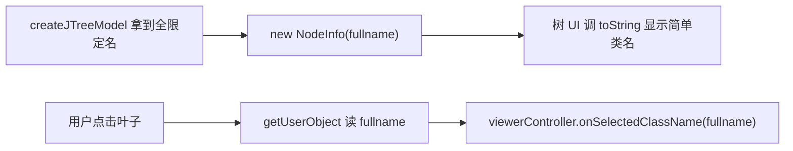

# 🧩 NodeInfo

<Badge type="tip" text="GUI 导航层" /> <Badge type="info" text="值对象" />

> 显示短名但持全限定名的树节点用户对象。

📁 源码：<code>ClassySharkWS/src/com/google/classyshark/gui/panel/tree/NodeInfo.java</code> &nbsp; 📦 包：<code>com.google.classyshark.gui.panel.tree</code>

## 职责

`NodeInfo` 是一个小专用值对象，作为 JTree 叶子节点的用户对象。它持有类的全限定名（`fullname`），但 `toString()` 只返回最后的简单类名段，使树 UI 整洁、无包路径杂乱。选择监听读取 `fullname` 字段把全限定名回传给 `SilverGhost` 翻译。

## 关键方法 / 字段

| 名称 | 类型 | 说明 |
|------|------|------|
| `fullname` | String | 全限定类名 |
| `NodeInfo(String)` | 构造 | 保存全限定名 |
| `toString()` | String | 返回简单类名（最后 `.` 后段） |
| `extractClassName(String)` | static String | 正则 `.*?([^.]+)$` 提取最后段 |

## 工作流程

## 设计要点

- 🪞 **显示与数据分离** — UI 显示短名，数据持有全名，兼顾整洁与可路由。
- 🔤 **正则提取** — `.*?([^.]+)$` 提取最后一个 `.` 之后的段，兼容无包名类。
- ♻️ **静态复用** — `extractClassName` 为 static，`FilesTree.main` 也直接调用。

## 协作关系

- 被使用 ← [[FilesTree]]（树叶子用户对象）
- 被使用 ← `SilverGhost`（经 fullname 翻译）

## 已知问题 / TODO

- 无明显已知问题；值对象职责单一稳定。

## 相关文档

- [GUI 架构](/reference/architecture/gui-layer)
- [[FilesTree]]
