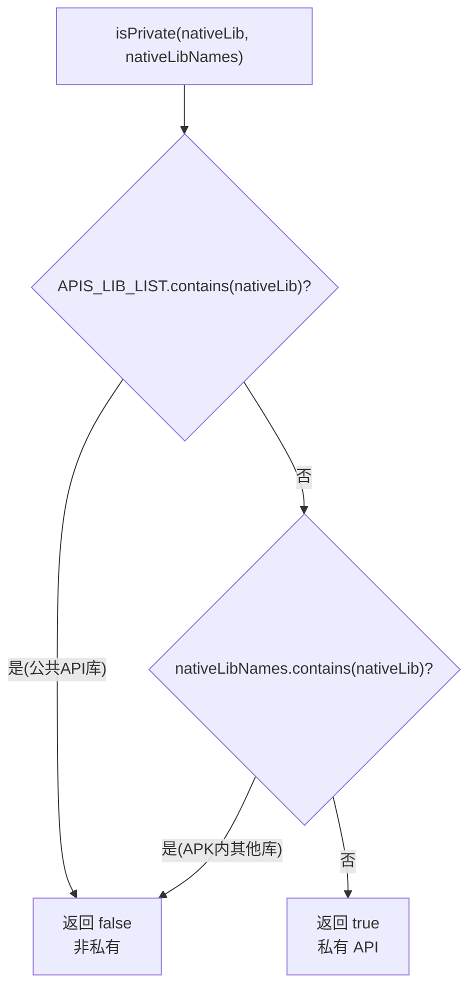

# 🧩 PrivateNativeLibsInspector

<Badge type="tip" text="APK Dashboard" /> <Badge type="info" text="静态检查器" />

> 静态纯函数：判断打包的 .so 是否既不在 Android 公共 NDK 白名单也不在 APK 内其他 .so 名中。

📁 源码：<code>ClassySharkWS/src/com/google/classyshark/silverghost/translator/apk/dashboard/PrivateNativeLibsInspector.java</code> &nbsp; 📦 包：<code>com.google.classyshark.silverghost.translator.apk.dashboard</code>

## 职责

`PrivateNativeLibsInspector` 是一个无状态的静态检查器，用于标记 Play Store 私有 API 策略违规的 .so：若一个原生库既不在 Android 公共 NDK API 库白名单（`libz.so`/`libc.so`/`libGLESv2.so`/`crtbegin_so.o` 等 26 项），也不在当前 APK 内其他 .so 名列表中，则视为私有。`isPrivate(nativeLib, nativeLibNames)` 是纯静态函数，由 `ApkDashboard.getPrivateLibErrorTag` 调用，命中时附加 ` -- private api!` 标记。

## 关键方法 / 字段

| 名称 | 类型 | 说明 |
|------|------|------|
| `apiLibs` | static String[] | 26 项 Android 公共 NDK 库白名单 |
| `APIS_LIB_LIST` | static List&lt;String&gt; | 由 apiLibs 构建的 LinkedList |
| `isPrivate(String, List&lt;String&gt;)` | static boolean | 白名单与 APK 内库名双重排除判定 |

## 工作流程

## 设计要点

- 🧩 **纯静态无状态** — 不持有实例字段，`isPrivate` 是纯函数，输入决定输出，易测试易复用。
- 📋 **白名单双重排除** — 私有 = 不在公共 API 白名单 AND 不在 APK 自身其他 .so 名中，逻辑简洁。
- 📦 **白名单覆盖典型公共库** — `apiLibs` 涵盖 `libz/libc/libm/liblog/libdl/libandroid/libEGL/libGLES*/libOpenSLES/libOpenMAXAL/libvulkan/libstdc++/libjnigraphics/libmediandk` 及 `crt*_*.o`，外加哨兵 `lsOutput.log`。
- 🏷️ **下游标记** — 命中后由 `ApkDashboard.getPrivateLibErrorTag` 附加 ` -- private api!`，仅私有库行进入仪表板。

## 协作关系

- 被 [[ApkDashboard]] 的 `getPrivateLibErrorTag` 调用
- 输入 `nativeLibNames` 来自 `ApkDashboard.getNativeLibNamesSorted`

## 已知问题 / TODO

- 无明显已知问题（纯函数，逻辑清晰）。

## 相关文档

- [APK Dashboard 架构](/reference/architecture/apk-dashboard)
- [Native 库检查](/reference/architecture/apk-dashboard)
