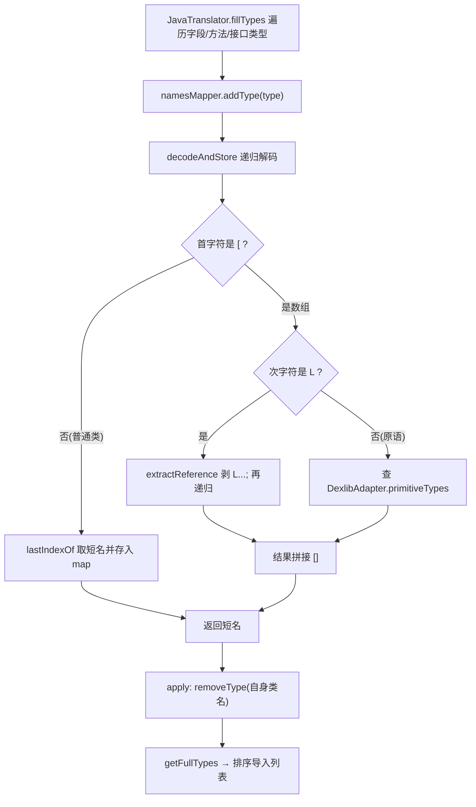

# 🧩 QualifiedTypesMap

<Badge type="tip" text="Java Translator" /> <Badge type="info" text="数据结构" />

> 全限定名→短名映射表，跟踪翻译中遇到的所有引用类型并生成导入列表。

📁 源码：<code>ClassySharkWS/src/com/google/classyshark/silverghost/translator/java/clazz/QualifiedTypesMap.java</code> &nbsp; 📦 包：<code>com.google.classyshark.silverghost.translator.java.clazz</code>

## 职责

`QualifiedTypesMap` 是 `JavaTranslator` 的类型登记簿。它在渲染过程中把每个遇到的全限定类型名（`java.util.Map`）解码成短名（`Map`）并登记到内部 HashMap；短名用于在源码存根中替换，全限定名键集（排序后）即为导入列表。它还能递归解码数组描述符（`[Ljava.util.Map;`→`Map[]`、`[I`→`int[]`），原语经 `DexlibAdapter.primitiveTypes` 翻译。

## 关键方法 / 字段

| 名称 | 类型 | 说明 |
|------|------|------|
| `full2types` | HashMap&lt;String,String&gt; | 全限定名→短名映射，键集即导入列表 |
| `addType(String)` | void | 解码并存入类型（仅登记） |
| `getType(String)` | String | 解码、存入并返回短名 |
| `getTypeNull(String)` | String | 解码并返回短名，但**不存入**（用于自身类名不进 import） |
| `removeType(String)` | void | 从映射移除某类型（apply 中剔除自身类名） |
| `getFullTypes()` | List&lt;String&gt; | 返回键集的排序后列表，即导入列表 |
| `decodeAndStore(String, HashMap)` | static String | 递归解码器：数组/引用/原语拆解，存入给定 map |
| `isArray(char)` | private static boolean | 判断字符是否为 `[` |
| `extractReference(String)` | private static String | 剥 `L...;` 包装取内部引用 |

## 工作流程

## 设计要点

- **登记与查询分离** — `addType`（只登记）、`getType`（登记并返回）、`getTypeNull`（返回不登记）三种语义，让调用方精确控制某类型是否进 import（自身类名用 `getTypeNull` 查找，避免自引用 import）。
- **递归数组解码** — `decodeAndStore` 递归处理多维数组与 `L...;` 引用包装，原语单字符经 `DexlibAdapter.primitiveTypes` 统一翻译，原语单一事实源。
- **导入列表即键集** — 不额外维护列表，`getFullTypes` 直接返回排序后的键集，简化数据流。
- **静态解码器复用** — `decodeAndStore` 是 static，可被 `MetaObjectClass.getFieldGenericsString` 等外部调用（传 null map 只解码不登记）。

## 协作关系

- 被 [[JavaTranslator]] 持有与驱动
- 依赖 → [[DexlibAdapter]]（原语映射 `primitiveTypes`）
- 被 [[MetaObjectClass]] 的 `getFieldGenericsString` 调用（解码泛型参数）

## 已知问题 / TODO

- `getTypeNull` 传 `null` map 给 `decodeAndStore`，依赖其内部 `if (hashMap != null)` 判空，耦合较隐晦。
- 数组解码对 `[` 前缀的处理依赖字符位置硬编码（`charAt(0)`/`charAt(1)`），对超长多维数组虽递归正确但可读性差。

## 相关文档

- [Java Translator 子系统](/reference/architecture/java-translator)
- [Java 翻译器](/reference/modules/JavaTranslator)
