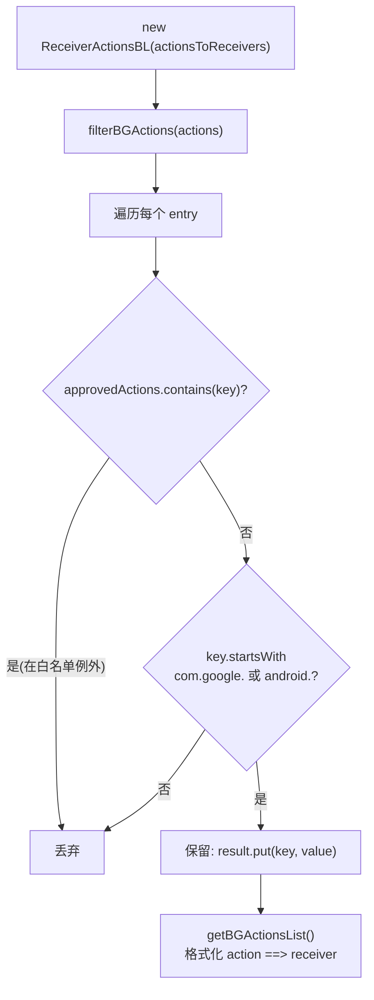

# 🧩 ReceiverActionsBL

<Badge type="tip" text="APK Dashboard" /> <Badge type="info" text="业务逻辑" />

> 清单检查业务逻辑：过滤出系统前缀且不在 Android 批准白名单中的隐式广播动作。

📁 源码：<code>ClassySharkWS/src/com/google/classyshark/silverghost/translator/apk/dashboard/manifest/ReceiverActionsBL.java</code> &nbsp; 📦 包：<code>com.google.classyshark.silverghost.translator.apk.dashboard.manifest</code>

## 职责

`ReceiverActionsBL`（BL=业务逻辑）接收 action→receiver 映射，过滤出 Android O+ 后台不安全的隐式广播动作。`filterBGActions` 做双重过滤：动作既不在 27 项 Android 批准例外白名单中（`approvedActions`，镜像 Android 后台执行限制白名单），又以 `com.google.` 或 `android.` 系统前缀开头，才视为后台不安全而保留。构造时即过滤，`getBGActionsList()` 把保留项格式化为 `action ==> receiver` 字符串列表。

## 关键方法 / 字段

| 名称 | 类型 | 说明 |
|------|------|------|
| `approvedActions` | static List&lt;String&gt; | 27 项 Android 批准的隐式广播例外 |
| `bgActionsToReceivers` | Map&lt;String,String&gt; | 过滤后的不安全动作→接收器 |
| `ReceiverActionsBL(Map)` | 构造器 | 保存 `filterBGActions(actions)` 结果 |
| `getBGActionsList()` | List&lt;String&gt; | 格式化 `action ==> receiver` |
| `filterBGActions(Map)` | private Map | 双重过滤逻辑 |

## 工作流程

## 设计要点

- 🔁 **双重过滤** — 保留条件 = 不在 approvedActions 白名单 AND 以系统前缀开头，逻辑等价于「系统级隐式广播且非批准例外」即 Android O+ 后台不安全。
- 📋 **白名单镜像官方** — `approvedActions` 列出 Android 后台执行限制白名单（`LOCKED_BOOT_COMPLETED`/`BOOT_COMPLETED`/`USB_*`/`LOGIN_ACCOUNTS_CHANGED` 等），来源注释指向官方文档。
- 🌳 **TreeMap 排序** — 过滤结果用 `TreeMap`，动作名天然有序，下游输出稳定。
- 🏷️ **格式化输出** — `getBGActionsList` 把每项拼成 `action ==> receiver`，便于仪表板直接展示。

## 协作关系

- 被 [[ManifestInspector]] 的 `getInspections()` 调用
- 输入 action→receiver 映射来自 [[AndroidManifestPlainTextReader]]

## 已知问题 / TODO

- `approvedActions` 列表含重复项（`USB_ACCESSORY_ATTACHED`/`USB_ACCESSORY_DETACHED`/`USB_DEVICE_ATTACHED`/`USB_DEVICE_DETACHED` 各出现两次），虽不影响 `contains` 语义但属冗余。
- 系统前缀仅认 `com.google.` 与 `android.`，第三方 ROM 自有系统前缀（如 `com.miui.`）不会被标记。

## 相关文档

- [APK Dashboard 架构](/reference/architecture/apk-dashboard)
- [Manifest 检查](/reference/architecture/apk-dashboard)
