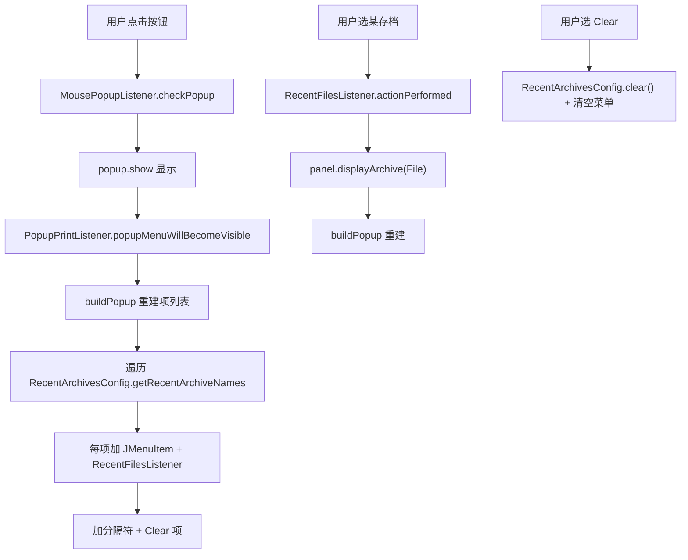

# 🧩 RecentArchivesButton

<Badge type="tip" text="GUI 工具栏层" /> <Badge type="info" text="按钮 + 弹窗" />

> JButton 点击开 JPopupMenu 列最近存档，每次打开重建反映当前配置。

📁 源码：<code>ClassySharkWS/src/com/google/classyshark/gui/panel/toolbar/RecentArchivesButton.java</code> &nbsp; 📦 包：<code>com.google.classyshark.gui.panel.toolbar</code>

## 职责

`RecentArchivesButton` 是一个 `JButton`，点击后弹出 `JPopupMenu` 列出 `RecentArchivesConfig` 的最近存档名加「Clear」项。每次弹窗将可见时通过 `PopupMenuListener` 重建条目列表，反映当前配置——新开存档立即出现无需重启。选中某项时委托 `ArchiveDisplayer.displayArchive` 复用同一加载路径。

## 关键方法 / 字段

| 名称 | 类型 | 说明 |
|------|------|------|
| `popup` | JPopupMenu | 弹出菜单 |
| `panel` | ToolbarController | 注入的显示接口 |
| `theme` | Theme | 缓存主题 |
| `buildPopup()` | private void | 填充最近存档项 + Clear 分隔符 |
| `setPanel(ToolbarController)` | void | 注入回调 |
| `RecentFilesListener` | 内部类 | 选中项 displayArchive |
| `MousePopupListener` | 内部类 | 鼠标按下/点击/释放触发弹窗 |
| `PopupPrintListener` | 内部类 | 弹窗将可见时重建 |

## 工作流程

## 设计要点

- 🔄 **每次打开重建** — `popupMenuWillBecomeVisible` 触发 `buildPopup`，确保新开存档即时出现。
- 🧬 **最小接口复用** — 通过 `ToolbarController`（继承 `ArchiveDisplayer`）调用 `displayArchive`，复用主加载路径。
- 🧹 **Clear 内联** — Clear 项清空配置后重建菜单，UI 即时反映。
- 🎨 **主题应用** — 弹窗与每个菜单项都 `theme.applyTo`。

## 协作关系

- 依赖 → [[ToolbarController]]、[[RecentArchivesConfig]]、[[GuiMode]]
- 被使用 ← [[Toolbar]]

## 已知问题 / TODO

- 🐛 `RecentFilesListener` 构造用 `archiveName`，若同名存档在不同目录会取错路径（`getFilePath` 按名查）。
- 🐛 Clear 项重建时只把自身加回，未重新 `buildPopup`，菜单可能丢失最近项直到下次打开。
- 🐛 弹窗位置用 `e.getX() - popup宽度` 计算略粗糙。

## 相关文档

- [GUI 架构](/reference/architecture/gui-layer)
- [[ToolbarController]]
- [[RecentArchivesConfig]]
