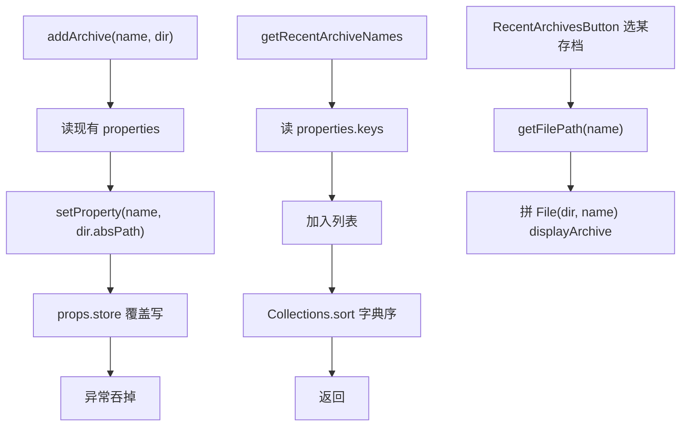

# 🧩 RecentArchivesConfig

<Badge type="tip" text="GUI IO 层" /> <Badge type="info" text="单例枚举" />

> 持久化最近存档到 classyshark_recents.properties 的单例枚举。

📁 源码：<code>ClassySharkWS/src/com/google/classyshark/gui/panel/io/RecentArchivesConfig.java</code> &nbsp; 📦 包：<code>com.google.classyshark.gui.panel.io</code>

## 职责

`RecentArchivesConfig` 是单例枚举，把最近打开的存档以「存档名为键、父目录为值」持久化到 `classyshark_recents.properties`。提供 `addArchive`、`clear`、`getRecentArchiveNames`（按字典序排序）、`getFilePath(name)`。与 `CurrentFolderConfig` 同为 Properties 存储风格，由 `RecentArchivesButton` 使用。

## 关键方法 / 字段

| 名称 | 类型 | 说明 |
|------|------|------|
| `INSTANCE` | enum 单例 | 全局唯一实例 |
| `CLASSYSHARK_RECENTS` | static String | 文件名 `classyshark_recents.properties` |
| `addArchive(name, dir)` | void | 写入存档→父目录 |
| `clear()` | void | 清空全部最近存档 |
| `getRecentArchiveNames()` | List&lt;String&gt; | 键集合，按字典序排序 |
| `getFilePath(name)` | String | 按名查父目录，失败返回空串 |

## 工作流程

## 设计要点

- 🧬 **枚举单例** — `enum INSTANCE` 序列化安全。
- 🗂️ **名→目录映射** — 以存档名为键、父目录为值，简化跨目录同名场景。
- 🔤 **字典序排序** — `Collections.sort` 按名字字典序，非最近使用（LRU）顺序。
- 🤫 **静默回退** — 异常吞掉，`getFilePath` 失败返回空串。

## 协作关系

- 被使用 ← [[RecentArchivesButton]]
- 与 [[CurrentFolderConfig]] 同存储风格

## 已知问题 / TODO

- 🐛 `getRecentArchiveNames` 按字典序排序而非最近性，最近开的存档不一定排在最前。
- 🐛 常量 `UPDATE_ARCHIVE = "CURRENT_FOLDER"` 命名误导（实为 properties 注释用），复制自 CurrentFolderConfig 未改名。
- 🐛 `addArchive` 与 `clear` 用 `props.store` 整文件覆盖，多线程并发写会丢数据。
- 🐛 异常空 catch 无日志，难以排查。

## 相关文档

- [GUI 架构](/reference/architecture/gui-layer)
- [[CurrentFolderConfig]]
- [[RecentArchivesButton]]
