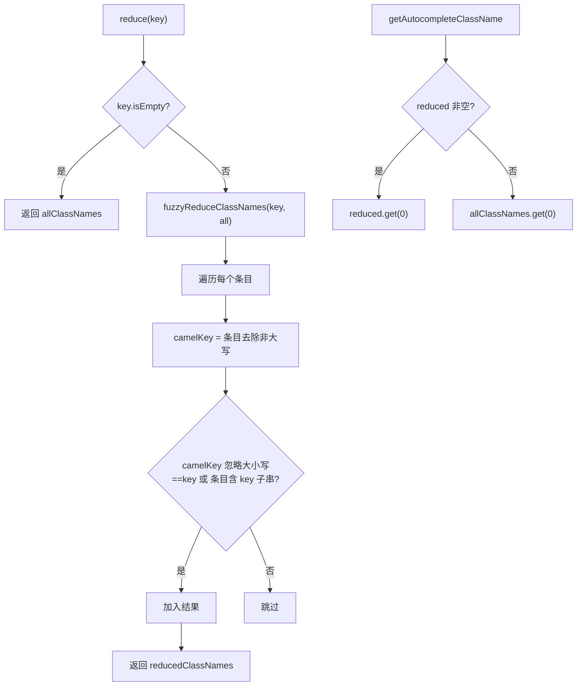

# 🧩 Reducer

<Badge type="tip" text="GUI 过滤层" /> <Badge type="info" text="纯函数" />

> 纯函数过滤器：(key, allClassNames) → reducedClassNames，支持子串与驼峰两种匹配。

📁 源码：<code>ClassySharkWS/src/com/google/classyshark/gui/panel/reducer/Reducer.java</code> &nbsp; 📦 包：<code>com.google.classyshark.gui.panel.reducer</code>

## 职责

`Reducer` 把类名列表按用户输入的 key 缩减。key 为空返回全部，否则做模糊匹配：子串匹配（`indexOf`）或驼峰匹配（比条目大写字符与 key，如 `SHC` 匹配 `StringHashCalculator`）。`getAutocompleteClassName` 返回首缩减结果或首类，驱动「查看顶级类」按钮。它无状态地保留 `allClassNames`/`reducedClassNames`。

## 关键方法 / 字段

| 名称 | 类型 | 说明 |
|------|------|------|
| `allClassNames` | List&lt;String&gt; | 全部类名 |
| `reducedClassNames` | List&lt;String&gt; | 当前缩减结果 |
| `reduce(String key)` | List&lt;String&gt; | key 空返回全部，否则模糊缩减 |
| `getAutocompleteClassName()` | String | 首缩减结果或首类 |
| `getAllClassNames()` | List&lt;String&gt; | 不可变全部类名 |
| `fuzzyReduceClassNames(key, list)` | static List | 双模式模糊匹配核心 |

## 工作流程

## 设计要点

- 🐫 **驼峰匹配** — ClassyShark 独特的类查找 UX：输入大写首字母即可命中（如 `SHC`→`StringHashCalculator`）。
- 🧩 **双模式** — 同一次遍历同时检查驼峰等值与子串包含，任一命中即收。
- 🧹 **不可变视图** — `getAllClassNames` 返回 `Collections.unmodifiableList`，防止外部篡改。
- ⚡ **静态核心** — `fuzzyReduceClassNames` 为 static，纯函数，可独立复用（`FilesTree.main` 也用）。
- 🎯 **自动补全** — `getAutocompleteClassName` 取首结果，简化「查看顶级类」逻辑。

## 协作关系

- 被使用 ← `SilverGhost`、[[FilesTree]]（main 测试）
- 依赖 → 无（纯 Java 集合）

## 已知问题 / TODO

- 🐛 驼峰匹配只比「条目所有大写字符串联」与 key 等值，无法表达子序列（如 `SHCal` 不匹配 `StringHashCalculator`，必须整串 `SHC`）。
- 🐛 `reduce` 在 key 空时 `reducedClassNames.clear()` 但返回 `allClassNames`，状态与返回值语义略不一致。

## 相关文档

- [GUI 架构](/reference/architecture/gui-layer)
- [[FilesTree]]
